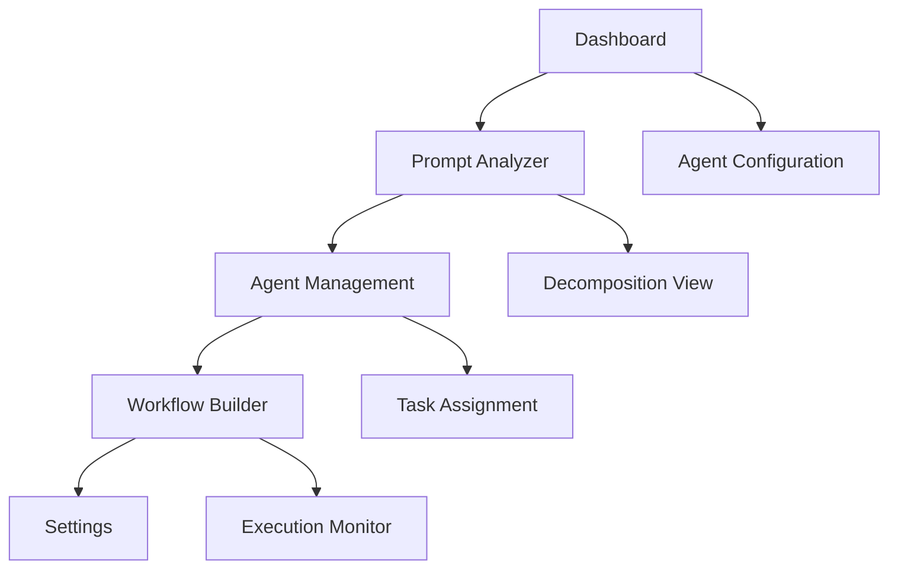

## 1. Product Overview
CrewManager is an intelligent multi-agent AI system that efficiently analyzes global prompts, decomposes them into smaller tasks, and assigns these tasks to specialized AI agents. The system ensures each agent focuses on precise sub-tasks while maintaining condensed yet essential global context, maximizing clarity, coherence, and execution accuracy.

This platform solves complex prompt processing challenges by orchestrating multiple AI agents with specialized roles, enabling businesses and developers to handle sophisticated AI workflows with enhanced efficiency and reliability.

## 2. Core Features

### 2.1 User Roles
| Role | Registration Method | Core Permissions |
|------|---------------------|------------------|
| Admin User | Email registration with admin privileges | Full system access, agent management, workflow configuration |
| Developer User | Email registration with developer role | Create and manage AI workflows, access API endpoints |
| Standard User | Email registration | View dashboards, monitor agent performance, basic workflow interaction |
| Guest User | No registration required | View public dashboards and basic system information |

### 2.2 Feature Module
Our CrewManager requirements consist of the following main pages:
1. **Dashboard**: Real-time agent monitoring, performance metrics, system overview.
2. **Agent Management**: Agent configuration, role assignment, task delegation settings.
3. **Workflow Builder**: Visual workflow creation, task dependencies, execution logic.
4. **Prompt Analyzer**: Global prompt input, decomposition visualization, sub-task assignment.
5. **Settings**: User preferences, system configuration, API key management.

### 2.3 Page Details
| Page Name | Module Name | Feature description |
|-----------|-------------|---------------------|
| Dashboard | Agent Status Overview | Display real-time status of all AI agents with activity indicators and performance metrics. |
| Dashboard | Task Execution Monitor | Show live task progress, completion rates, and execution timelines with visual progress bars. |
| Dashboard | System Health Metrics | Monitor system resource usage, error rates, and uptime statistics with trend graphs. |
| Agent Management | Agent Configuration | Configure agent roles, capabilities, and specialization parameters with validation. |
| Agent Management | Task Assignment Panel | Assign and reassign tasks between agents with drag-and-drop interface and priority settings. |
| Agent Management | Agent Performance Analytics | View historical performance data, success rates, and learning improvements over time. |
| Workflow Builder | Visual Workflow Canvas | Create workflows using drag-and-drop nodes with connection lines showing task dependencies. |
| Workflow Builder | Task Properties Editor | Define task parameters, inputs, outputs, and execution conditions with form validation. |
| Workflow Builder | Execution Logic Designer | Set up conditional logic, loops, and parallel execution paths with visual flow controls. |
| Prompt Analyzer | Global Prompt Input | Large text area for entering complex prompts with syntax highlighting and validation. |
| Prompt Analyzer | Decomposition Viewer | Visual tree structure showing how global prompt breaks down into sub-tasks. |
| Prompt Analyzer | Agent Assignment Matrix | Table view showing which agents handle which sub-tasks with status indicators. |
| Settings | User Profile Management | Update user information, preferences, and notification settings. |
| Settings | API Configuration | Manage API keys, webhooks, and integration settings with security validation. |
| Settings | System Preferences | Configure global system settings, themes, and performance parameters. |

## 3. Core Process
The main user operation flow begins with accessing the Dashboard to view system status. Users can then navigate to the Prompt Analyzer to input complex global prompts. The system automatically decomposes these prompts and displays the breakdown in the visual workflow. Users can review and modify agent assignments in the Agent Management section before executing workflows.

Admin users have additional capabilities to configure system-wide settings and manage user permissions. The system supports both manual workflow creation and AI-assisted automatic generation based on prompt analysis.

## 4. User Interface Design

### 4.1 Design Style
- **Primary Color**: Teal (#14B8A6) - Modern, environmental feel
- **Secondary Color**: Slate Gray (#64748B) - Professional contrast
- **Button Style**: Rounded corners with subtle shadows, teal primary buttons
- **Font**: Inter font family, 16px base size with responsive scaling
- **Layout Style**: Card-based layout with consistent spacing and modern aesthetics
- **Icon Style**: Feather icons for consistency and clean appearance

### 4.2 Page Design Overview
| Page Name | Module Name | UI Elements |
|-----------|-------------|-------------|
| Dashboard | Agent Status Overview | Teal gradient cards with status indicators, circular progress meters, real-time updating counters |
| Dashboard | Task Execution Monitor | Horizontal progress bars with percentage completion, color-coded status badges, timeline visualization |
| Agent Management | Agent Configuration | Form inputs with teal focus states, toggle switches for agent states, dropdown selectors |
| Workflow Builder | Visual Workflow Canvas | SVG-based flowchart with draggable nodes, connection lines with arrow indicators, zoom controls |
| Prompt Analyzer | Decomposition Viewer | Tree diagram with expandable nodes, color-coded agent assignments, interactive tooltips |

### 4.3 Responsiveness
Desktop-first design approach with mobile-responsive breakpoints at 768px and 1024px. Touch interaction optimization for tablet devices with larger tap targets and gesture support for workflow canvas interactions.

### 4.4 3D Scene Guidance
Not applicable for this web-based dashboard application.