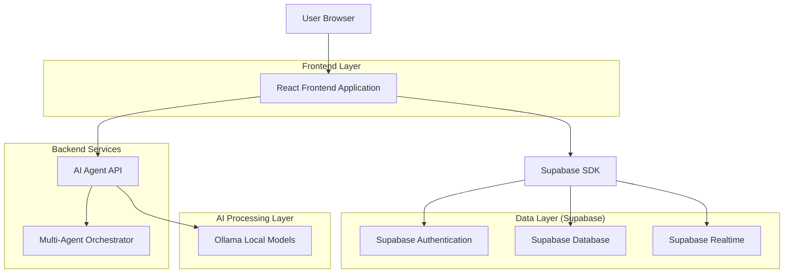
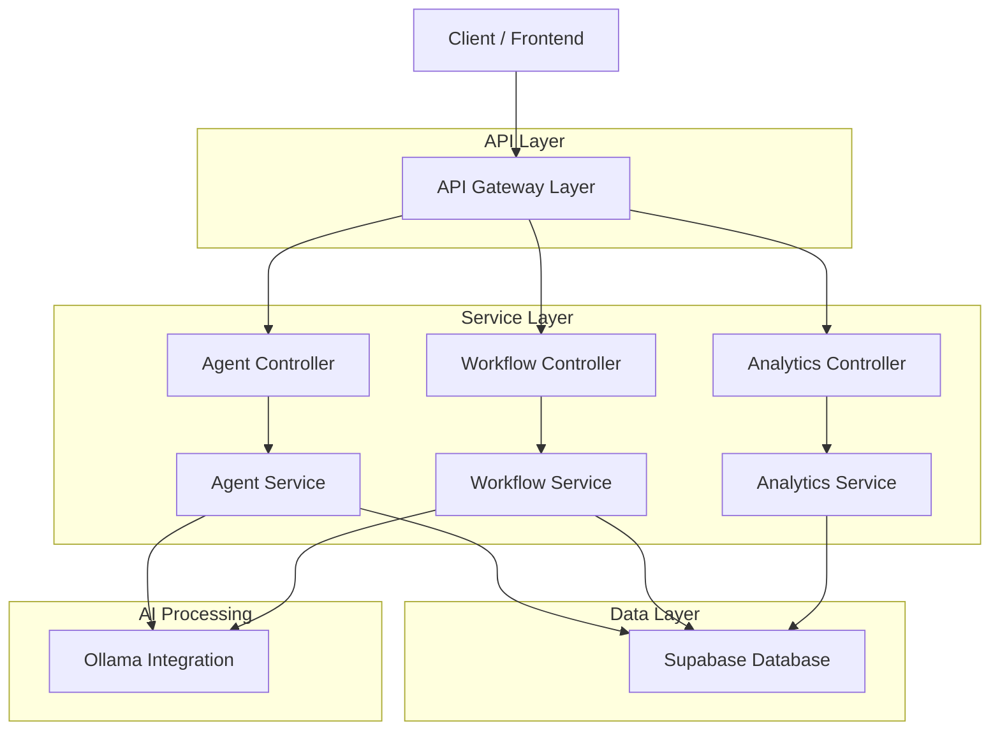
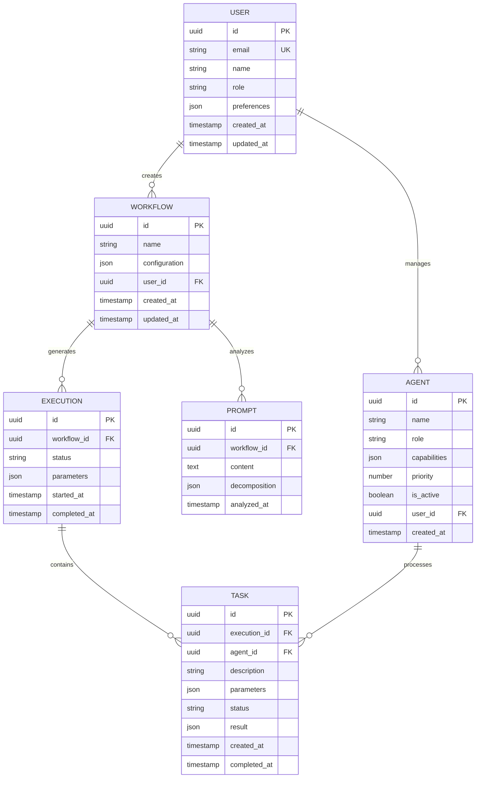

## 1. Architecture Design



## 2. Technology Description
- Frontend: React@18 + tailwindcss@3 + vite
- Initialization Tool: vite-init
- Backend: Supabase (PostgreSQL, Authentication, Realtime)
- AI Processing: Ollama with fine-tuned local models
- State Management: React Context + Custom Hooks
- UI Components: HeadlessUI + Custom Teal-themed components
- Real-time Communication: Supabase Realtime subscriptions

## 3. Route Definitions
| Route | Purpose |
|-------|---------|
| / | Dashboard - Main overview with agent status and system metrics |
| /agents | Agent Management - Configure and monitor AI agents |
| /workflows | Workflow Builder - Create and manage AI workflows |
| /analyzer | Prompt Analyzer - Decompose and analyze global prompts |
| /settings | Settings - User preferences and system configuration |
| /login | Login - User authentication page |
| /register | Register - User registration page |
| /profile | Profile - User profile management |

## 4. API Definitions

### 4.1 Agent Management API
```
POST /api/agents/create
```

Request:
| Param Name | Param Type | isRequired | Description |
|------------|-------------|-------------|-------------|
| name | string | true | Agent name identifier |
| role | string | true | Agent role type (prompter, developer, ui_generator, etc.) |
| capabilities | array | true | List of agent capabilities |
| priority | number | false | Execution priority level (1-10) |

Response:
| Param Name | Param Type | Description |
|------------|-------------|-------------|
| agent_id | string | Unique agent identifier |
| status | string | Agent creation status |
| config | object | Agent configuration object |

### 4.2 Workflow Execution API
```
POST /api/workflows/execute
```

Request:
| Param Name | Param Type | isRequired | Description |
|------------|-------------|-------------|-------------|
| workflow_id | string | true | Workflow identifier |
| global_prompt | string | true | Global prompt to process |
| parameters | object | false | Execution parameters |

Response:
| Param Name | Param Type | Description |
|------------|-------------|-------------|
| execution_id | string | Unique execution identifier |
| status | string | Execution status (pending, running, completed, failed) |
| tasks | array | List of assigned sub-tasks |

### 4.3 Prompt Analysis API
```
POST /api/analyzer/decompose
```

Request:
| Param Name | Param Type | isRequired | Description |
|------------|-------------|-------------|-------------|
| prompt | string | true | Global prompt to analyze |
| context | object | false | Additional context information |

Response:
| Param Name | Param Type | Description |
|------------|-------------|-------------|
| decomposition | object | Structured prompt breakdown |
| sub_tasks | array | List of identified sub-tasks |
| agent_assignments | array | Agent-to-task mapping |

## 5. Server Architecture Diagram



## 6. Data Model

### 6.1 Data Model Definition


### 6.2 Data Definition Language

User Table (users)
```sql
-- create table
CREATE TABLE users (
    id UUID PRIMARY KEY DEFAULT gen_random_uuid(),
    email VARCHAR(255) UNIQUE NOT NULL,
    name VARCHAR(100) NOT NULL,
    role VARCHAR(50) DEFAULT 'user' CHECK (role IN ('admin', 'developer', 'user', 'guest')),
    preferences JSONB DEFAULT '{}',
    created_at TIMESTAMP WITH TIME ZONE DEFAULT NOW(),
    updated_at TIMESTAMP WITH TIME ZONE DEFAULT NOW()
);

-- create index
CREATE INDEX idx_users_email ON users(email);
CREATE INDEX idx_users_role ON users(role);

-- enable RLS
ALTER TABLE users ENABLE ROW LEVEL SECURITY;

-- create policies
CREATE POLICY "Users can view their own profile" ON users FOR SELECT USING (auth.uid() = id);
CREATE POLICY "Users can update their own profile" ON users FOR UPDATE USING (auth.uid() = id);
```

Agent Table (agents)
```sql
-- create table
CREATE TABLE agents (
    id UUID PRIMARY KEY DEFAULT gen_random_uuid(),
    name VARCHAR(100) NOT NULL,
    role VARCHAR(50) NOT NULL CHECK (role IN ('global_manager', 'prompter', 'developer', 'ui_generator', 'prompt_manager', 'diagram_generator')),
    capabilities JSONB DEFAULT '[]',
    priority INTEGER DEFAULT 5 CHECK (priority >= 1 AND priority <= 10),
    is_active BOOLEAN DEFAULT true,
    user_id UUID REFERENCES users(id) ON DELETE CASCADE,
    created_at TIMESTAMP WITH TIME ZONE DEFAULT NOW()
);

-- create index
CREATE INDEX idx_agents_user_id ON agents(user_id);
CREATE INDEX idx_agents_role ON agents(role);
CREATE INDEX idx_agents_active ON agents(is_active);

-- enable RLS
ALTER TABLE agents ENABLE ROW LEVEL SECURITY;

-- create policies
CREATE POLICY "Users can view their agents" ON agents FOR SELECT USING (auth.uid() = user_id);
CREATE POLICY "Users can create their agents" ON agents FOR INSERT WITH CHECK (auth.uid() = user_id);
CREATE POLICY "Users can update their agents" ON agents FOR UPDATE USING (auth.uid() = user_id);
```

Workflow Table (workflows)
```sql
-- create table
CREATE TABLE workflows (
    id UUID PRIMARY KEY DEFAULT gen_random_uuid(),
    name VARCHAR(255) NOT NULL,
    configuration JSONB DEFAULT '{}',
    user_id UUID REFERENCES users(id) ON DELETE CASCADE,
    created_at TIMESTAMP WITH TIME ZONE DEFAULT NOW(),
    updated_at TIMESTAMP WITH TIME ZONE DEFAULT NOW()
);

-- create index
CREATE INDEX idx_workflows_user_id ON workflows(user_id);
CREATE INDEX idx_workflows_created_at ON workflows(created_at DESC);

-- enable RLS
ALTER TABLE workflows ENABLE ROW LEVEL SECURITY;

-- create policies
CREATE POLICY "Users can view their workflows" ON workflows FOR SELECT USING (auth.uid() = user_id);
CREATE POLICY "Users can create workflows" ON workflows FOR INSERT WITH CHECK (auth.uid() = user_id);
CREATE POLICY "Users can update their workflows" ON workflows FOR UPDATE USING (auth.uid() = user_id);
```

Execution Table (executions)
```sql
-- create table
CREATE TABLE executions (
    id UUID PRIMARY KEY DEFAULT gen_random_uuid(),
    workflow_id UUID REFERENCES workflows(id) ON DELETE CASCADE,
    status VARCHAR(50) DEFAULT 'pending' CHECK (status IN ('pending', 'running', 'completed', 'failed', 'cancelled')),
    parameters JSONB DEFAULT '{}',
    started_at TIMESTAMP WITH TIME ZONE,
    completed_at TIMESTAMP WITH TIME ZONE,
    created_at TIMESTAMP WITH TIME ZONE DEFAULT NOW()
);

-- create index
CREATE INDEX idx_executions_workflow_id ON executions(workflow_id);
CREATE INDEX idx_executions_status ON executions(status);
CREATE INDEX idx_executions_created_at ON executions(created_at DESC);

-- enable RLS
ALTER TABLE executions ENABLE ROW LEVEL SECURITY;

-- create policies
CREATE POLICY "Users can view their executions" ON executions FOR SELECT USING (
    EXISTS (
        SELECT 1 FROM workflows 
        WHERE workflows.id = executions.workflow_id 
        AND workflows.user_id = auth.uid()
    )
);
```

Task Table (tasks)
```sql
-- create table
CREATE TABLE tasks (
    id UUID PRIMARY KEY DEFAULT gen_random_uuid(),
    execution_id UUID REFERENCES executions(id) ON DELETE CASCADE,
    agent_id UUID REFERENCES agents(id) ON DELETE SET NULL,
    description TEXT NOT NULL,
    parameters JSONB DEFAULT '{}',
    status VARCHAR(50) DEFAULT 'pending' CHECK (status IN ('pending', 'running', 'completed', 'failed')),
    result JSONB,
    created_at TIMESTAMP WITH TIME ZONE DEFAULT NOW(),
    completed_at TIMESTAMP WITH TIME ZONE
);

-- create index
CREATE INDEX idx_tasks_execution_id ON tasks(execution_id);
CREATE INDEX idx_tasks_agent_id ON tasks(agent_id);
CREATE INDEX idx_tasks_status ON tasks(status);
CREATE INDEX idx_tasks_created_at ON tasks(created_at DESC);

-- enable RLS
ALTER TABLE tasks ENABLE ROW LEVEL SECURITY;

-- create policies
CREATE POLICY "Users can view their tasks" ON tasks FOR SELECT USING (
    EXISTS (
        SELECT 1 FROM executions 
        JOIN workflows ON workflows.id = executions.workflow_id 
        WHERE executions.id = tasks.execution_id 
        AND workflows.user_id = auth.uid()
    )
);
```

-- Grant permissions
GRANT SELECT ON users TO anon;
GRANT SELECT, INSERT, UPDATE ON users TO authenticated;
GRANT SELECT ON agents TO anon;
GRANT SELECT, INSERT, UPDATE ON agents TO authenticated;
GRANT SELECT ON workflows TO anon;
GRANT SELECT, INSERT, UPDATE ON workflows TO authenticated;
GRANT SELECT ON executions TO anon;
GRANT SELECT, INSERT, UPDATE ON executions TO authenticated;
GRANT SELECT ON tasks TO anon;
GRANT SELECT, INSERT, UPDATE ON tasks TO authenticated;