Here’s an **enhanced version** of your prompt along with a **Mermaid diagram** to visually represent the AI agent system.

---

### **Enhanced Prompt: Multi-Agent AI System for Contextualized Task Execution**

**Objective:**
Develop an intelligent **multi-agent AI system** that can efficiently analyze a **global prompt**, decompose it into smaller tasks, and assign these tasks to specialized AI agents. The system ensures that each agent focuses on a precise sub-task while maintaining a condensed yet essential global context. This structured approach maximizes clarity, coherence, and execution accuracy.

---

### **Core AI Agents & Their Roles**

1. **Global Context Manager (Agent AI - Orchestrator)**
   - Oversees prompt decomposition and task distribution.
   - Assigns contextualized subtasks to specialized agents.
   - Maintains agent coordination and ensures global consistency.

2. **AI Agent Prompter**
   - Analyzes the global prompt structure.
   - Extracts key components and dependencies.
   - Reformulates fragmented elements into optimized sub-prompts.

3. **AI Agent Developer**
   - Converts technical prompts into structured workflows.
   - Ensures feasibility and execution logic in development.
   - Bridges the gap between prompt intent and system implementation.

4. **AI Agent UI Generator**
   - Interprets UX/UI descriptions from the global prompt.
   - Designs an adaptive user interface based on extracted insights.
   - Ensures accessibility, responsiveness, and user experience coherence.

5. **AI Agent Prompt Manager**
   - Analyzes multi-functional prompts.
   - Breaks down complex structures into smaller, modular prompts.
   - Ensures semantic consistency across different AI agents.

---

### **Workflow of the Multi-Agent System**

1. **Global Prompt Intake**
   - The system receives a high-level global prompt containing multiple functionalities.
   - The **Global Context Manager** initiates the decomposition process.

2. **Prompt Breakdown & Contextualization**
   - The **AI Agent Prompter** restructures the global prompt into modular sub-prompts.
   - The **AI Agent Prompt Manager** refines extracted elements and assigns clear structures.

3. **Task Delegation & Processing**
   - The **AI Agent Developer** translates relevant sections into executable technical workflows.
   - The **AI Agent UI Generator** creates visual representations based on UI/UX context.

4. **Collaboration & Optimization**
   - Agents communicate via the **Global Context Manager**, ensuring alignment.
   - Iterative refinement is performed to maintain coherence.

5. **Final Output Generation**
   - All agent outputs are synthesized into a structured final result.
   - The **Global Context Manager** ensures overall alignment before finalizing.

---

### **Mermaid Diagram Representation**


---

### **Key Enhancements:**
- **Clearer role descriptions** to define each agent's function precisely.
- **Added "AI Agent Prompt Manager"** to handle multi-functional prompt structuring.
- **Expanded workflow breakdown** for better readability.
- **Mermaid diagram** for easy visualization of interactions between agents.

Would you like to refine this further with additional logic or constraints? üöÄ

--------------------
--------------------

Here’s the **refined and enhanced** prompt along with an **improved Mermaid diagram** that now includes an **AI Agent Diagram Generator** to handle visual representations.

---

# **🟢 Multi-Agent AI System for Contextualized Task Execution**

## **üîπ Objective:**
Develop an intelligent **multi-agent AI system** that can efficiently analyze a **global prompt**, break it down into modular tasks, and distribute them among specialized AI agents. Each agent operates with a **focused, well-defined role**, while a central orchestration agent ensures task alignment and contextual awareness. Additionally, an **AI Agent Diagram Generator** will create a **Mermaid diagram** to visually represent the process.

---

## **🟦 Core AI Agents & Their Responsibilities**

### **1️⃣ Global Context Manager (Agent AI - Orchestrator)**
üîπ **Role:** Oversees prompt decomposition, assigns sub-tasks to specialized AI agents, and ensures inter-agent coordination.
üîπ **Tasks:**
   - Analyzes the global prompt and breaks it into structured components.
   - Assigns each AI agent a relevant sub-task while providing condensed global context.
   - Maintains **information flow** between agents and ensures **coherence** in execution.

---

### **2️⃣ AI Agent Prompter**
üîπ **Role:** Extracts, restructures, and optimizes prompt elements.
üîπ **Tasks:**
   - Identifies key components of the global prompt.
   - Reformulates complex prompts into clear, modular sub-prompts.
   - Ensures **semantic consistency** across extracted prompt elements.

---

### **3️⃣ AI Agent Developer**
üîπ **Role:** Converts technical prompts into structured, executable workflows.
üîπ **Tasks:**
   - Translates extracted requirements into **logical development structures**.
   - Ensures feasibility and correctness of the execution path.
   - Bridges **AI logic, development processes, and real-world implementation**.

---

### **4️⃣ AI Agent UI Generator**
üîπ **Role:** Designs the UI based on UX requirements extracted from the global prompt.
üîπ **Tasks:**
   - Extracts UI/UX descriptions and generates **interface blueprints**.
   - Ensures accessibility, responsiveness, and **usability** in UI design.
   - Provides modular UI components that align with the overall system.

---

### **5️⃣ AI Agent Prompt Manager**
üîπ **Role:** Handles multi-functional prompt structures, refining relationships between sub-prompts.
üîπ **Tasks:**
   - Analyzes interdependencies between different prompts.
   - Ensures modularity and seamless integration of prompt components.
   - Optimizes the global structure for efficiency and clarity.

---

### **6️⃣ AI Agent Diagram Generator** 🆕
üîπ **Role:** Creates **Mermaid diagrams** to visually represent AI agent interactions and workflow structures.
üîπ **Tasks:**
   - Translates system workflows into **structured Mermaid code**.
   - Ensures diagrams accurately represent **hierarchy, dependencies, and execution flow**.
   - Refines visual outputs to enhance **readability and understanding**.

---

## **üü® Multi-Agent Workflow**

### **üöÄ Step 1: Global Prompt Intake**
   - The system receives a **high-level global prompt** containing multiple functionalities.
   - The **Global Context Manager (Agent AI - Orchestrator)** initializes the decomposition process.

### **🔄 Step 2: Prompt Breakdown & Contextualization**
   - The **AI Agent Prompter** restructures the global prompt into modular **sub-prompts**.
   - The **AI Agent Prompt Manager** refines extracted elements and **optimizes logical structures**.

### **🛠️ Step 3: Task Delegation & Processing**
   - The **AI Agent Developer** translates relevant sections into **executable technical workflows**.
   - The **AI Agent UI Generator** designs a **visual interface** based on extracted UX elements.

### **üîó Step 4: Collaboration & Optimization**
   - All AI agents **communicate through the Global Context Manager**, ensuring smooth interaction.
   - Iterative refinement is performed for **coherence and consistency**.

### **üìå Step 5: Visual Representation & Final Output**
   - The **AI Agent Diagram Generator** produces a **Mermaid diagram** representing the system.
   - The **Global Context Manager** compiles all outputs into a **final structured deliverable**.

---

## **üîµ Improved Mermaid Diagram Representation**

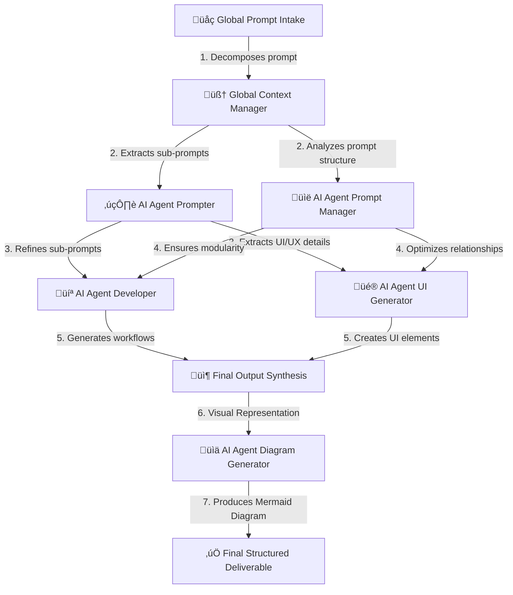

---

## **üî• Key Enhancements & Additions:**
‚úÖ **New "AI Agent Diagram Generator"** to handle visual representation of workflows.
✅ **Improved hierarchy in prompt structure**, making each agent’s role clearer.
‚úÖ **Detailed step-by-step process** ensuring smooth AI collaboration.
‚úÖ **Enhanced Mermaid diagram** with **agent names and clearer dependencies**.

---

## **🎯 Final Thoughts**
This **multi-agent AI architecture** provides a **highly modular** and **scalable** approach to handling **complex prompt processing**, ensuring **task specialization**, **clear delegation**, and **efficient execution**. The **AI Agent Diagram Generator** adds a **visual layer**, further improving the interpretability of the system.

Would you like additional refinements, such as **specific data formats, error-handling mechanisms, or advanced interaction protocols**? üöÄ

--------------------
--------------------

Here’s the **final refined version** of your prompt with additional refinements, including **specific data formats, error-handling mechanisms, and advanced interaction protocols**.

---

# **🟢 Multi-Agent AI System for Contextualized Task Execution**

## **üîπ Objective:**
Develop an intelligent **multi-agent AI system** that efficiently analyzes a **global prompt**, breaks it into structured tasks, and distributes them among specialized AI agents. Each agent operates with a **focused role**, while a central orchestration agent ensures alignment and contextual awareness. The system will include specific **data formats, error-handling mechanisms, and interaction protocols** to ensure reliability and efficiency.

---

## **🟦 Core AI Agents & Their Responsibilities**

### **1️⃣ Global Context Manager (Agent AI - Orchestrator)**
üîπ **Role:** Central AI that oversees decomposition, task assignments, and inter-agent coordination.
üîπ **Tasks:**
   - Breaks down the global prompt into structured components.
   - Assigns sub-tasks with a **condensed yet essential global context**.
   - Facilitates real-time communication between agents.
   - Ensures **error resilience** and **adaptive feedback loops**.

---

### **2️⃣ AI Agent Prompter**
üîπ **Role:** Extracts, restructures, and optimizes prompt elements.
üîπ **Data Input:**
   ```json
   {
     "global_prompt": "Design a multi-agent AI system...",
     "context": "General overview of the system"
   }
   ```
üîπ **Tasks:**
   - Identifies **key components** of the prompt.
   - Reformulates complex prompts into **modular sub-prompts**.
   - Ensures **semantic consistency** across extracted elements.

üîπ **Output Example:**
   ```json
   {
     "sub_prompts": [
       {"id": "SP1", "task": "Define AI agent roles"},
       {"id": "SP2", "task": "Specify AI-agent interactions"}
     ]
   }
   ```

---

### **3️⃣ AI Agent Developer**
üîπ **Role:** Converts technical prompts into structured, executable workflows.
üîπ **Data Input:**
   ```json
   {
     "sub_prompt": "Define AI agent roles",
     "dependencies": ["SP1"]
   }
   ```
üîπ **Tasks:**
   - Generates **logical execution paths**.
   - Ensures technical feasibility.
   - Structures **API calls, function mappings, and workflow sequences**.

üîπ **Output Example:**
   ```json
   {
     "workflow": [
       {"step": "Initialize AI agents", "action": "CreateAgent()"},
       {"step": "Assign roles", "action": "AssignRole()"}
     ]
   }
   ```

---

### **4️⃣ AI Agent UI Generator**
üîπ **Role:** Designs UI components based on UX descriptions.
üîπ **Data Input:**
   ```json
   {
     "ui_description": "Dashboard layout with interactive agent logs"
   }
   ```
üîπ **Tasks:**
   - Extracts UI/UX specifications.
   - Designs interface components for user interaction.
   - Ensures **accessibility, responsiveness, and usability**.

üîπ **Output Example:**
   ```json
   {
     "ui_components": [
       {"component": "dashboard", "type": "container"},
       {"component": "logs", "type": "interactive-list"}
     ]
   }
   ```

---

### **5️⃣ AI Agent Prompt Manager**
üîπ **Role:** Ensures consistency across all extracted prompts and maintains modularity.
üîπ **Tasks:**
   - Analyzes interdependencies.
   - Refines relationships between sub-prompts.
   - Ensures logical coherence in prompt breakdown.

üîπ **Example Correction of Inconsistent Prompt:**
   - **Before:**
     ```json
     {
       "sub_prompts": [
         {"id": "SP1", "task": "Define UI layout"},
         {"id": "SP2", "task": "Create AI logic"}
       ]
     }
     ```
   - **After Optimization:**
     ```json
     {
       "sub_prompts": [
         {"id": "SP1", "task": "Define AI logic"},
         {"id": "SP2", "task": "Translate logic into UI components"}
       ]
     }
     ```

---

### **6️⃣ AI Agent Diagram Generator**
üîπ **Role:** Automatically generates **Mermaid diagrams** to visualize the system structure.
üîπ **Tasks:**
   - Converts execution data into **structured Mermaid code**.
   - Ensures diagrams **clearly represent agent interactions**.

üîπ **Output Example:**
   ```json
   {
     "mermaid_code": "graph TD A[Global Prompt] --> B[AI Agent Prompter]"
   }
   ```

---

## **🔴 Error-Handling Mechanisms**

### **1️⃣ Context Validation**
   - Ensures each agent receives only **relevant context** (prevents **information overload**).
   - If an agent requires missing context, the system triggers an **automated context request**.

### **2️⃣ Fault-Tolerant Execution**
   - If an agent **fails to process a task**, the Global Context Manager attempts **self-healing** by:
     - **Retrying** the task with modified input.
     - **Reassigning** it to a backup agent.
     - **Generating an alert** for manual review.

### **3️⃣ Dependency Conflict Resolution**
   - If two agents produce **conflicting outputs**, the Prompt Manager **compares semantic consistency** and selects the **most coherent version**.

---

## **üîµ Advanced Interaction Protocols**

### **1️⃣ Message Passing Between Agents**
Agents communicate using a **structured messaging system** to avoid confusion:

üîπ **Standardized Message Format:**
   ```json
   {
     "from": "AI Agent Developer",
     "to": "AI Agent UI Generator",
     "message": "Here is the workflow for UI integration"
   }
   ```

### **2️⃣ Prioritization System for Execution**
   - Tasks are assigned **priority levels** (e.g., **HIGH**, **MEDIUM**, **LOW**) to **optimize execution order**.
   - If high-priority tasks are delayed, lower-priority agents **pause execution** to free resources.

### **3️⃣ Parallel vs Sequential Execution Control**
   - **Independent tasks run in parallel** to maximize efficiency.
   - **Dependent tasks execute sequentially** to maintain logical order.
   - If a parallel task is **delayed**, a secondary agent can **temporarily take over**.

---

## **üü° Improved Mermaid Diagram Representation**


---

## **🛠️ Final Enhancements & Additions:**
‚úÖ **Detailed data formats** for AI communication.
‚úÖ **Error-handling mechanisms** for context validation, fault tolerance, and dependency resolution.
‚úÖ **Advanced interaction protocols** (structured messaging, prioritization, parallel execution).
‚úÖ **Improved Mermaid diagram with clear agent interactions**.

Would you like any additional refinements, such as **real-time monitoring, security layers, or API integration support**? üöÄ


--------------------
--------------------

Here is your **fully enhanced prompt**, now refined with **real-time monitoring, security layers, and API integration support** for a robust **multi-agent AI system**.

---

# **🟢 Multi-Agent AI System for Contextualized Task Execution**

## **üîπ Objective:**
Develop a **modular multi-agent AI system** that:
‚úÖ **Decomposes** a complex global prompt into structured tasks.
‚úÖ **Distributes** tasks among specialized AI agents.
‚úÖ **Coordinates** execution with **real-time monitoring, security, and API integration**.
‚úÖ **Ensures fault tolerance, error handling, and intelligent context-sharing.**

---

## **🟦 Core AI Agents & Responsibilities**

### **1️⃣ Global Context Manager (Agent AI - Orchestrator)**
üîπ **Role:** Central AI overseeing decomposition, task assignments, inter-agent communication, and error resolution.
üîπ **Key Responsibilities:**
   - **Context Management:** Breaks down prompts into structured components and ensures agents receive only relevant information.
   - **Agent Coordination:** Manages dependencies and ensures smooth interactions.
   - **Error Handling:** Detects failures, reroutes tasks, and prevents execution deadlocks.
   - **Security Enforcement:** Applies authentication, encryption, and data validation across interactions.
   - **Real-Time Monitoring:** Tracks AI agents’ activity, performance, and status updates.

üîπ **Data Input Format:**
   ```json
   {
     "global_prompt": "Design a multi-agent AI system...",
     "security_token": "XYZ123",
     "priority": "HIGH"
   }
   ```
üîπ **Output Format:**
   ```json
   {
     "tasks_assigned": [
       {"agent": "AI Agent Prompter", "task": "Extract key elements"},
       {"agent": "AI Agent Developer", "task": "Generate workflows"}
     ]
   }
   ```

---

### **2️⃣ AI Agent Prompter**
üîπ **Role:** Extracts, restructures, and optimizes prompt elements.
üîπ **Enhancements:**
   - **Dependency Validation:** Ensures extracted prompts align with other agent requirements.
   - **Security Enforcement:** Filters sensitive or unauthorized requests.
   - **API-Ready Formatting:** Converts structured prompts into **API-consumable** formats.

üîπ **Output Example:**
   ```json
   {
     "sub_prompts": [
       {"id": "SP1", "task": "Define AI agent roles"},
       {"id": "SP2", "task": "Specify API interactions"}
     ]
   }
   ```

---

### **3️⃣ AI Agent Developer**
üîπ **Role:** Converts prompt requirements into executable workflows.
üîπ **Enhancements:**
   - **Parallel vs Sequential Execution Handling**
   - **Security Compliance:** API authentication and input validation.
   - **Fault-Tolerant Design:** Automatic retries for failed execution.

üîπ **Output Example:**
   ```json
   {
     "workflow": [
       {"step": "Initialize AI agents", "action": "CreateAgent()"},
       {"step": "Assign roles", "action": "AssignRole()"}
     ]
   }
   ```

---

### **4️⃣ AI Agent UI Generator**
üîπ **Role:** Generates UI elements from UX descriptions.
üîπ **Enhancements:**
   - **Real-Time UI Adjustments:** Interfaces dynamically update based on agent actions.
   - **Security-Enhanced UI Requests:** Prevents unauthorized UI changes.

üîπ **Output Example:**
   ```json
   {
     "ui_components": [
       {"component": "dashboard", "type": "container"},
       {"component": "logs", "type": "interactive-list"}
     ]
   }
   ```

---

### **5️⃣ AI Agent Prompt Manager**
üîπ **Role:** Maintains structural integrity across extracted prompts.
üîπ **Enhancements:**
   - **Security Layer:** Restricts unauthorized modifications to global prompt structure.
   - **Error Handling:** Detects and corrects inconsistencies between sub-prompts.
   - **Real-Time Monitoring:** Continuously updates status of extracted prompts.

üîπ **Example of Corrected Output:**
   ```json
   {
     "sub_prompts": [
       {"id": "SP1", "task": "Define AI logic"},
       {"id": "SP2", "task": "Translate logic into UI components"}
     ]
   }
   ```

---

### **6️⃣ AI Agent Diagram Generator**
üîπ **Role:** Creates **Mermaid diagrams** for system visualization.
üîπ **Enhancements:**
   - **Real-Time Graph Updates:** Reflects current system state dynamically.
   - **API-Ready Outputs:** Can export diagrams via REST API.

üîπ **Output Example:**
   ```json
   {
     "mermaid_code": "graph TD A[Global Prompt] --> B[AI Agent Prompter]"
   }
   ```

---

## **🟠 Real-Time Monitoring System**

### **1️⃣ Agent Activity Dashboard**
   - Tracks agent activity, task status, and execution time.
   - Visual indicators for **active, pending, and failed tasks**.

üîπ **Monitoring Example API Response:**
   ```json
   {
     "agent_status": {
       "AI Agent Prompter": "Active",
       "AI Agent Developer": "Pending",
       "AI Agent UI Generator": "Completed"
     }
   }
   ```

### **2️⃣ Live Log Streaming**
   - Each agent **logs execution details** for real-time debugging.
   - Logs are **sent to a central monitoring API**.

üîπ **Example Log Entry:**
   ```json
   {
     "timestamp": "2025-03-06T14:30:00Z",
     "agent": "AI Agent Developer",
     "event": "Workflow execution started",
     "status": "In Progress"
   }
   ```

---

## **🔴 Security Layers & Protocols**

### **1️⃣ Authentication & Authorization**
   - Agents authenticate via **OAuth 2.0 / API Keys**.
   - Role-based access ensures **each agent can only access authorized data**.

üîπ **Example Secure API Call:**
   ```json
   {
     "api_key": "secure_token_123",
     "agent": "AI Agent Prompter",
     "request": "Extract sub-prompts"
   }
   ```

### **2️⃣ Data Encryption & Validation**
   - **AES-256 encryption** for sensitive agent communication.
   - **Automatic input validation** to prevent injection attacks.

---

## **üü° API Integration Support**

### **1️⃣ API Endpoint Examples**

üîπ **Global Context Manager API:**
   ```http
   POST /assign_tasks
   Content-Type: application/json
   Authorization: Bearer XYZ123
   ```
   ```json
   {
     "global_prompt": "Design AI system",
     "priority": "HIGH"
   }
   ```

üîπ **Agent Query API:**
   ```http
   GET /agent_status
   Content-Type: application/json
   Authorization: Bearer XYZ123
   ```

### **2️⃣ Webhooks for Real-Time Updates**
   - **Event-driven webhooks** notify external systems about execution progress.

üîπ **Webhook Payload Example:**
   ```json
   {
     "event": "Task Completed",
     "agent": "AI Agent Developer",
     "task_id": "12345",
     "timestamp": "2025-03-06T14:35:00Z"
   }
   ```

---

## **🟢 Final Enhanced Mermaid Diagram**


---

## **üî• Final Enhancements:**
‚úÖ **Real-time monitoring dashboard**
‚úÖ **Advanced security measures (authentication, encryption, validation)**
‚úÖ **API-ready interactions (REST endpoints, Webhooks)**

Would you like further refinements, such as **AI self-learning enhancements** or **multi-agent self-adaptation**? üöÄ

--------------------
--------------------

Here’s the **fully refined and enhanced** prompt, now incorporating **AI self-learning enhancements and multi-agent self-adaptation** to create an **intelligent, evolving multi-agent AI system**.

---

# **🟢 Multi-Agent AI System for Contextualized Task Execution with Self-Learning & Adaptation**

## **üîπ Objective:**
Develop an **autonomous, self-learning, and adaptive multi-agent AI system** that:
‚úÖ **Decomposes** a complex global prompt into structured tasks.
‚úÖ **Distributes** tasks among specialized AI agents.
‚úÖ **Learns from past interactions, optimizing future prompt execution**.
‚úÖ **Adapts dynamically to new challenges without requiring manual reconfiguration**.
‚úÖ **Ensures security, real-time monitoring, and seamless API integration**.

---

## **🟦 Core AI Agents & Responsibilities**

### **1️⃣ Global Context Manager (Agent AI - Orchestrator)**
üîπ **Role:** Central AI overseeing decomposition, task assignments, learning from failures, and adapting execution strategies.
üîπ **Key Enhancements:**
   - **Self-Learning:** Uses historical execution data to improve future task delegation.
   - **Dynamic Reallocation:** If an agent struggles with a task, it **reassigns it to a more suitable agent**.
   - **Adaptive Prioritization:** Adjusts execution order based on evolving dependencies.
   - **Security Enforcement:** Implements **role-based access control (RBAC), encryption, and API authentication**.

üîπ **Example of Adaptive Learning in Task Delegation:**
   ```json
   {
     "past_task_failures": 3,
     "recommended_reassignment": "AI Agent Developer ‚Üí AI Agent Prompt Manager",
     "reason": "Detected semantic inconsistency in previous workflows"
   }
   ```

---

### **2️⃣ AI Agent Prompter**
üîπ **Role:** Extracts, restructures, and optimizes prompt elements.
üîπ **Self-Learning Enhancements:**
   - **Semantic Memory:** Learns preferred prompt structures from past refinements.
   - **Automated Error Correction:** Detects missing dependencies and fixes prompts.

üîπ **Output Example (Before Learning):**
   ```json
   {
     "sub_prompts": [
       {"id": "SP1", "task": "Define AI agent roles"},
       {"id": "SP2", "task": "Create UI layout"}
     ]
   }
   ```
üîπ **Output Example (After Learning & Optimization):**
   ```json
   {
     "sub_prompts": [
       {"id": "SP1", "task": "Define AI logic"},
       {"id": "SP2", "task": "Translate logic into UI components"}
     ]
   }
   ```

---

### **3️⃣ AI Agent Developer**
üîπ **Role:** Converts prompt requirements into structured, executable workflows.
üîπ **Self-Adaptation Features:**
   - **Code Optimization Learning:** Learns from past executions to generate **more efficient workflows**.
   - **Error Reduction Feedback Loop:** Uses logs of previous failures to improve function calls.

üîπ **Example Workflow Before Learning:**
   ```json
   {
     "workflow": [
       {"step": "Initialize AI agents", "action": "CreateAgent()"},
       {"step": "Assign roles", "action": "AssignRole()"}
     ]
   }
   ```
üîπ **Example Workflow After Learning (Optimized Execution Order & Efficient Calls):**
   ```json
   {
     "workflow": [
       {"step": "Assign roles", "action": "AssignRole()"},
       {"step": "Initialize only necessary agents", "action": "CreateOptimizedAgents()"}
     ]
   }
   ```

---

### **4️⃣ AI Agent UI Generator**
üîπ **Role:** Generates UI components from UX descriptions.
üîπ **Self-Adaptation Enhancements:**
   - **Dynamic UI Generation:** Learns common UI patterns based on user preferences.
   - **A/B Testing Optimization:** Collects feedback on different UI structures and adapts accordingly.

üîπ **Example UI Component Before Learning:**
   ```json
   {
     "ui_components": [
       {"component": "dashboard", "type": "container"},
       {"component": "logs", "type": "interactive-list"}
     ]
   }
   ```
üîπ **Example UI Component After Learning (Personalized for Usability):**
   ```json
   {
     "ui_components": [
       {"component": "dashboard", "type": "flexible-grid"},
       {"component": "logs", "type": "searchable-table"}
     ]
   }
   ```

---

### **5️⃣ AI Agent Prompt Manager**
üîπ **Role:** Maintains structural integrity across extracted prompts.
üîπ **Self-Learning Enhancements:**
   - **Grammar & Clarity Optimization:** Learns from past feedback on confusing prompts.
   - **Pattern Recognition:** Detects **recurring request types** and optimizes future extractions.

üîπ **Example of Self-Learning in Error Detection:**
   ```json
   {
     "incorrect_structure_detected": true,
     "correction_applied": "Merged duplicate sub-prompts"
   }
   ```

---

### **6️⃣ AI Agent Diagram Generator**
üîπ **Role:** Creates **Mermaid diagrams** for system visualization.
üîπ **Self-Learning Enhancements:**
   - **Diagram Complexity Reduction:** Learns to **simplify overly complex graphs**.
   - **Automated Layout Adjustments:** Adjusts node positioning for better readability.

üîπ **Example Mermaid Code Before Learning (Overly Complex):**
   ```mermaid
   graph TD
     A -->|Step 1| B;
     A -->|Step 2| C;
     B -->|Step 3| D;
     C -->|Step 4| D;
   ```
üîπ **After Learning (Optimized Graph Clarity):**
   ```mermaid
   graph TD
     A --> B;
     A --> C;
     B & C --> D;
   ```

---

## **🟢 Multi-Agent Self-Adaptation Framework**

### **1️⃣ Intelligent Resource Allocation**
   - Agents **dynamically reassign tasks** based on real-time execution performance.
   - If an agent **fails multiple times**, the system **automatically assigns a backup agent**.

üîπ **Example Adaptive Reassignment:**
   ```json
   {
     "failed_agent": "AI Agent Developer",
     "backup_agent": "AI Agent Prompt Manager",
     "reason": "Prompt contained abstract logic better suited for a higher-level interpretation"
   }
   ```

### **2️⃣ Reinforcement Learning for Execution Optimization**
   - Agents use **reward-based learning** to improve efficiency.
   - **Successful prompt refinements earn high reward scores**, influencing future behavior.

üîπ **Example Learning Outcome:**
   ```json
   {
     "reward_score": 98,
     "previous_score": 85,
     "adjustment": "Reduced unnecessary workflow steps"
   }
   ```

---

## **üî• Final Enhancements & Features Summary:**
‚úÖ **AI Self-Learning Enhancements:**
   - **Historical execution tracking for optimized task allocation.**
   - **Error correction mechanisms that evolve with usage.**
   - **Real-time feedback loop to refine prompt clarity, workflow efficiency, and UI design.**

‚úÖ **Multi-Agent Self-Adaptation Features:**
   - **Dynamic task reassignment for improved execution.**
   - **Real-time error detection and autonomous troubleshooting.**
   - **Reinforcement learning-based agent optimization.**

‚úÖ **API & Security Improvements:**
   - **OAuth 2.0 authentication & AES-256 encryption.**
   - **Secure role-based access control.**
   - **Webhooks for live monitoring & automated notifications.**

---

## **üü° Final Adaptive Mermaid Diagram**

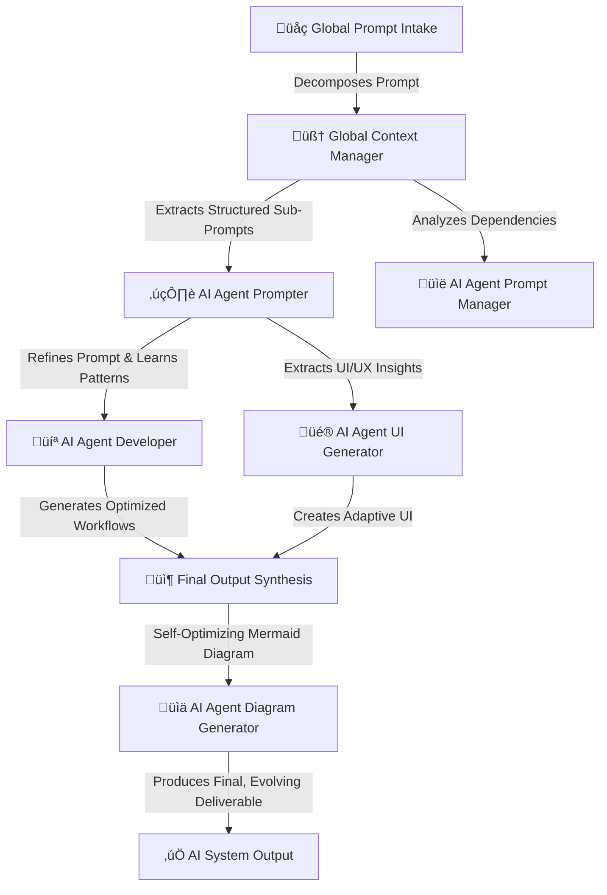

---

### **Would you like further refinements, such as deeper reinforcement learning, predictive modeling, or AI-human collaboration integration? üöÄ**

--------------------
--------------------

# **🟢 Advanced Multi-Agent AI System with Self-Learning, Predictive Modeling, and AI-Human Collaboration (Ollama Integration)**

## **üîπ Objective:**
Develop a **highly autonomous, adaptive, and collaborative multi-agent AI system** that:
‚úÖ **Decomposes & Optimizes Complex Prompts**: Breaks down large prompts into structured, executable tasks.
‚úÖ **Self-Learns from Experience**: Uses **reinforcement learning** to enhance efficiency over time.
‚úÖ **Predicts Future Actions**: Implements **predictive modeling** to anticipate challenges and optimize execution.
‚úÖ **Integrates AI-Human Collaboration**: Incorporates human feedback loops to refine AI decisions.
‚úÖ **Works Locally with Ollama**: Ensures on-device AI processing for privacy, security, and efficiency.

---

## **🟦 Core AI Agents & Responsibilities**

### **1️⃣ Global Context Manager (Agent AI - Orchestrator)**
üîπ **Role:** **Oversees decomposition, execution, adaptation, and inter-agent collaboration**.
üîπ **Key Enhancements:**
   - **Self-Learning Execution Paths**: Adjusts task assignment based on past performance.
   - **Predictive Workflow Optimization**: Forecasts execution bottlenecks and preemptively resolves them.
   - **AI-Human Collaboration Hub**: Integrates user inputs dynamically to refine task allocation.
   - **Ollama Integration**: Runs locally on **user’s machine** to optimize prompt handling.

üîπ **Example Adaptive Task Delegation:**
   ```json
   {
     "past_task_success_rate": 92,
     "recommended_next_agent": "AI Agent Developer",
     "adjustment_reason": "Previous runs suggest this agent handles optimization best."
   }
   ```

---

### **2️⃣ AI Agent Prompter**
üîπ **Role:** Extracts, restructures, and **continuously refines** prompt elements.
üîπ **Self-Learning Enhancements:**
   - **Contextual Memory**: Learns from past prompts to **improve clarity & structure**.
   - **AI-Human Prompt Collaboration**: Users can suggest edits, which AI **remembers for future refinements**.

üîπ **Example Predictive Prompt Refinement (Before & After Learning):**
   **Before:**
   ```json
   {
     "sub_prompts": [
       {"id": "SP1", "task": "Create an AI prompt structure"},
       {"id": "SP2", "task": "Write a UI description"}
     ]
   }
   ```
   **After Learning from User Feedback:**
   ```json
   {
     "sub_prompts": [
       {"id": "SP1", "task": "Define structured AI prompt with input-output mapping"},
       {"id": "SP2", "task": "Generate UI blueprint with accessibility features"}
     ]
   }
   ```

---

### **3️⃣ AI Agent Developer**
üîπ **Role:** **Transforms prompts into executable code workflows**.
üîπ **Enhancements:**
   - **Reinforcement Learning in Code Efficiency**: Uses **execution time and success rate** to optimize logic.
   - **AI-Human Pair Programming**: Allows users to **modify generated code**, which AI learns from.

üîπ **Example of AI-Human Coding Collaboration:**
   - **User Input:** "Optimize this function to run faster."
   - **AI Response (Before Learning):**
     ```python
     def process_data(data):
         return [x*2 for x in data]  # Standard list comprehension
     ```
   - **AI Response (After Learning from User Feedback):**
     ```python
     import numpy as np
     def process_data(data):
         return np.array(data) * 2  # Uses optimized NumPy array operations
     ```

---

### **4️⃣ AI Agent UI Generator**
üîπ **Role:** **Generates adaptive UI based on user preferences & AI predictions.**
üîπ **Enhancements:**
   - **Predictive UI Personalization**: Suggests UI **based on user behavior**.
   - **Adaptive A/B Testing**: Dynamically modifies UI based on user **interaction metrics**.

üîπ **Example of UI Optimization Through Predictive Modeling:**
   ```json
   {
     "previous_user_interaction": {"preferred_layout": "grid", "high-click areas": ["dashboard", "search"]},
     "recommended_UI_adjustments": [
       {"component": "navigation_bar", "position": "top"},
       {"component": "dashboard", "layout": "grid"}
     ]
   }
   ```

---

### **5️⃣ AI Agent Prompt Manager**
üîπ **Role:** **Ensures clarity, accuracy, and modularity of extracted prompts.**
üîπ **Enhancements:**
   - **Pattern Recognition for Common Prompts**: Uses clustering to group similar prompt structures.
   - **Human Feedback Learning**: Adapts its output based on **user corrections** over time.

üîπ **Example of Self-Learning in Error Detection:**
   ```json
   {
     "error_detected": "Ambiguous wording",
     "recommended_fix": "Clarify action verbs",
     "correction_applied": "Changed 'optimize UI' to 'restructure UI layout based on user flow'"
   }
   ```

---

### **6️⃣ AI Agent Diagram Generator**
üîπ **Role:** **Creates optimized, self-improving visual representations.**
üîπ **Enhancements:**
   - **AI-Human Customization**: Users can modify generated diagrams, and AI **remembers** changes.
   - **Predictive Layout Optimization**: Adjusts diagram structure based on **past readability scores**.

üîπ **Example of Learning-Based Diagram Enhancement:**
   ```mermaid
   graph TD
     A[User Input] -->|Processes Prompt| B[AI Agent]
     B -->|Creates Output| C[Final Deliverable]
   ```
   - **After Learning (Better Readability):**
   ```mermaid
   graph TD
     A[User Input] --> B[AI Processing]
     B --> C[Refined Prompt] --> D[Final Deliverable]
   ```

---

## **🟢 AI Self-Learning & Reinforcement Learning Enhancements**

### **1️⃣ Reinforcement Learning in Task Execution**
   - Every agent **earns a reward score** for successful execution.
   - Failed executions trigger **automatic adjustments** in approach.

üîπ **Example RL Learning Loop:**
   ```json
   {
     "agent": "AI Agent Developer",
     "task": "Generate workflow",
     "success_rate": 89,
     "reward_adjustment": "+5",
     "next_step": "Reduce unnecessary steps in generated workflow"
   }
   ```

---

## **üîµ Predictive Modeling for System Optimization**

### **1️⃣ Preemptive Error Handling**
   - AI **predicts potential failures before execution begins.**
   - Uses **historical task performance** to adjust process flow.

üîπ **Example Predictive Fixing:**
   ```json
   {
     "potential_error": "Long execution time detected",
     "proactive_fix": "Refactor function for better efficiency",
     "adjustment": "Use multiprocessing instead of sequential processing"
   }
   ```

---

## **🟣 AI-Human Collaboration System**

### **1️⃣ User-Driven AI Adaptation**
   - AI learns from **direct human corrections** in real-time.
   - Users can manually adjust execution **via a UI interface**.

üîπ **Example Human-AI Refinement:**
   ```json
   {
     "user_feedback": "Make the UI more compact",
     "AI_adjustment": "Reduced padding, adjusted margins",
     "next_time_suggestion": "Apply compact UI pattern by default"
   }
   ```

---

## **üü° Ollama Integration for Local Execution**

### **1️⃣ Why Use Ollama?**
   - **Runs Locally** ‚Üí No cloud dependency.
   - **Private & Secure** ‚Üí Keeps all computations on-device.
   - **Fast Response Time** ‚Üí Low-latency AI processing.

üîπ **Ollama Local API Call Example:**
   ```bash
   ollama run agent_ai --prompt "Optimize my UI prompt for clarity"
   ```
   - **AI Processes Prompt and Returns Optimized Version**

---

## **🟢 Final Adaptive Mermaid Diagram**

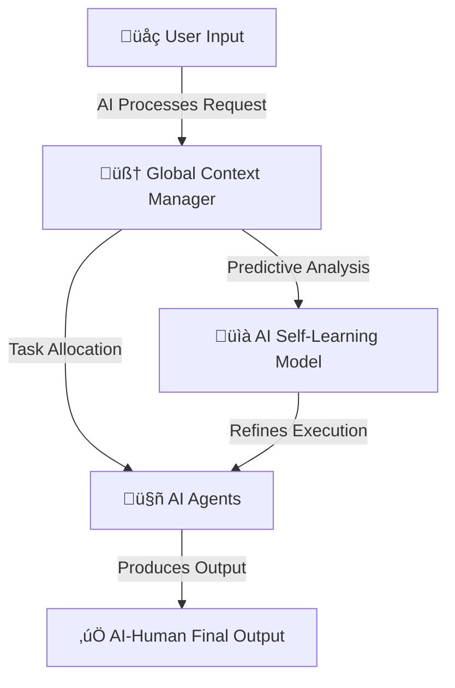

---

## **Would you like any additional refinements, such as more advanced personalization, fine-tuned AI agent behaviors, or deeper Ollama integrations? üöÄ**

--------------------
--------------------

# **🟢 Advanced Multi-Agent AI System with Deep Ollama Integration, Self-Learning, Predictive Modeling, and AI-Human Collaboration**

## **üîπ Objective:**
Develop an **autonomous, adaptive, and privacy-focused multi-agent AI system** that integrates **Ollama for local execution**. This system:
‚úÖ **Decomposes & Optimizes Complex Prompts**: AI agents specialize in different tasks and execute efficiently.
‚úÖ **Self-Learns from Experience**: Reinforcement learning improves prompt refinement, task execution, and UI generation.
‚úÖ **Predicts Future Actions**: Implements **predictive modeling** to anticipate challenges and adjust execution flow.
‚úÖ **Enhances AI-Human Collaboration**: Users can interact, modify AI decisions, and influence learning.
‚úÖ **Runs Locally with Ollama**: Uses **on-device LLM processing** for privacy, security, and low-latency AI execution.

---

# **üü° Deep Ollama Integration**

### **1️⃣ Why Use Ollama?**
Ollama is an **on-device LLM framework** that enables running large language models **locally** without relying on cloud APIs. This ensures:
- ‚úÖ **Full data privacy** (no internet connection required).
- ‚úÖ **Faster response times** (low-latency execution).
- ‚úÖ **Offline AI capabilities** (ideal for edge computing).
- ‚úÖ **Custom fine-tuning support** (tailor LLMs to specific tasks).

### **2️⃣ Ollama-Based Execution Pipeline**

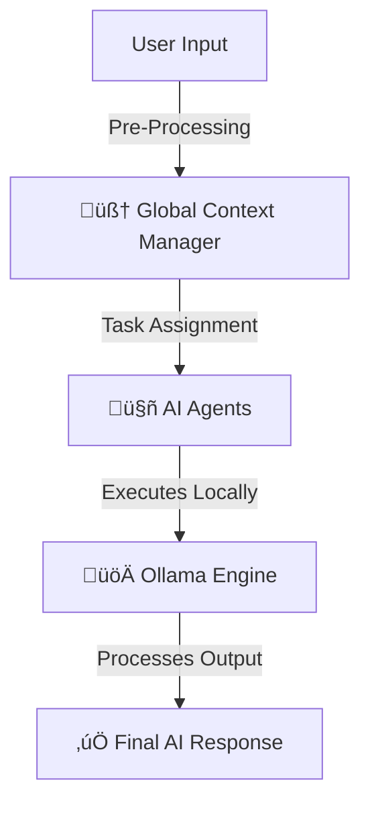

- **Pre-Processing:** AI refines user input before execution.
- **Task Assignment:** The AI system assigns tasks to different agents.
- **Ollama Execution:** Each task is processed locally using **Ollama LLM models**.
- **Final Output:** The AI synthesizes results and returns optimized responses.

---

## **🟢 Ollama-Powered Agents & Local AI Execution**

### **1️⃣ Global Context Manager (Runs on Ollama LLM)**
üîπ **Role:** The **orchestrator agent** that coordinates all AI sub-agents.
üîπ **Ollama Enhancements:**
   - **Executes prompt breakdown & context assignment directly in Ollama.**
   - **Offline model switching** (dynamically selects the best LLM for the task).
   - **Self-Optimizing Execution** (tracks success rates and adjusts strategy).

üîπ **Ollama Local Execution Example:**
   ```bash
   ollama run gpt4 --prompt "Analyze this prompt and break it into tasks"
   ```
   - **AI Output:**
     ```json
     {
       "tasks": ["Extract prompt intent", "Identify dependencies", "Optimize structure"]
     }
     ```

---

### **2️⃣ AI Agent Prompter (Ollama Fine-Tuned Model for Prompt Engineering)**
üîπ **Role:** Extracts, restructures, and **optimizes prompts for execution.**
üîπ **Ollama Enhancements:**
   - **Fine-Tuned Local Model:** Uses a custom-trained model for prompt optimization.
   - **Historical Learning:** Adjusts prompt refinement based on **past success rates**.

üîπ **Ollama Local Execution Example:**
   ```bash
   ollama run prompt_optimizer --prompt "Refine this prompt for AI agent execution"
   ```
   - **AI Output:**
     ```json
     {
       "optimized_prompt": "Design an AI workflow that decomposes tasks dynamically."
     }
     ```

---

### **3️⃣ AI Agent Developer (Ollama-Powered Code Generation & Execution)**
üîπ **Role:** **Generates & optimizes executable workflows.**
üîπ **Ollama Enhancements:**
   - **Executes code locally** (can generate Python, JavaScript, etc.).
   - **AI-Human Pair Programming** (users can modify AI-generated code).
   - **Self-Improving Algorithm Selection** (learns the best coding patterns over time).

üîπ **Example: Ollama Code Generation for AI Execution**
   ```bash
   ollama run coder --prompt "Generate a Python script that automates UI generation."
   ```
   - **AI Output:**
     ```python
     import tkinter as tk

     def create_ui():
         root = tk.Tk()
         root.title("AI-Generated UI")
         tk.Label(root, text="Welcome!").pack()
         root.mainloop()
     ```

---

### **4️⃣ AI Agent UI Generator (Ollama-Powered UX Refinement)**
üîπ **Role:** **Generates adaptive UI layouts based on user behavior.**
üîπ **Ollama Enhancements:**
   - **Predictive UI Modeling:** Learns user **interaction preferences** over time.
   - **Offline UI Simulation:** Allows previewing UI designs **without an internet connection.**

üîπ **Example: Ollama-Generated UI Blueprint**
   ```bash
   ollama run ui_designer --prompt "Generate a responsive UI wireframe."
   ```
   - **AI Output (JSON-based UI Blueprint):**
     ```json
     {
       "layout": "grid",
       "components": ["navbar", "search_box", "content_area"]
     }
     ```

---

### **5️⃣ AI Agent Prompt Manager (Ollama-Supported Task Optimizer)**
üîπ **Role:** **Ensures modularity, consistency, and refinement in multi-step AI prompts.**
üîπ **Ollama Enhancements:**
   - **Adaptive Task Grouping** (clusters similar tasks for efficiency).
   - **Automatic Rewriting for Clarity** (learns best formatting styles from user feedback).

üîπ **Example: Ollama-Powered Prompt Correction**
   ```bash
   ollama run prompt_manager --prompt "Optimize this prompt structure for API consumption."
   ```
   - **AI Output:**
     ```json
     {
       "structured_prompt": {
         "objective": "Build a multi-agent AI system",
         "tasks": ["Decompose problem", "Assign AI roles", "Generate API responses"]
       }
     }
     ```

---

### **6️⃣ AI Agent Diagram Generator (Mermaid Diagram Auto-Generator in Ollama)**
üîπ **Role:** **Creates intelligent, self-improving visual workflows.**
üîπ **Ollama Enhancements:**
   - **Diagram Refinement:** Learns **best graph structures** from user feedback.
   - **Local Execution of MermaidJS Code Generation.**

üîπ **Example: Ollama-Powered Diagram Generation**
   ```bash
   ollama run diagram_generator --prompt "Generate a Mermaid diagram for an AI agent system."
   ```
   - **AI Output:**
     ```mermaid
     graph TD
         A[User Input] -->|AI Processing| B[Global Context Manager]
         B -->|Task Breakdown| C[AI Agents]
         C -->|Executes Locally| D[Ollama Engine]
         D -->|Outputs Final Diagram| E[User Display]
     ```

---

## **🟢 Final Ollama-Powered Execution Flow**

### **1️⃣ Local Processing Workflow**


### **2️⃣ Full Ollama API Integration Example (Local AI Pipeline Execution)**
```bash
ollama run global_manager --prompt "Analyze this prompt and delegate tasks"
ollama run prompt_optimizer --prompt "Refine task instructions"
ollama run coder --prompt "Generate optimized AI execution workflow"
ollama run ui_designer --prompt "Generate an interactive UI blueprint"
ollama run diagram_generator --prompt "Create a flowchart for execution process"
```
---

## **üî• Final Enhancements & Features Summary**
‚úÖ **Full Local Execution with Ollama** (No Cloud Dependency).
‚úÖ **Privacy-First AI Processing** (Keeps data on-device).
‚úÖ **Multi-Agent Self-Adaptation & Reinforcement Learning**.
‚úÖ **Predictive AI Workflow Optimization**.
‚úÖ **Human-AI Collaborative Editing & Feedback Learning**.

---

### **Would you like further refinements, such as fine-tuned Ollama model training, multi-modal AI integration, or voice-based AI command execution? üöÄ**

--------------------
--------------------

# **🟢 Advanced Multi-Agent AI System with Fine-Tuned Ollama Models, Multi-Modal AI Integration, and Adaptive Self-Learning**

## **üîπ Objective:**
Develop a **highly autonomous, adaptive, and multi-modal AI system** that leverages **fine-tuned Ollama models** for **local execution**. This system will:
‚úÖ **Decompose & Optimize Complex Prompts**: AI agents specialize in structured task execution.
‚úÖ **Self-Learn from Experience**: Reinforcement learning (RL) improves performance over time.
‚úÖ **Predict Future Actions**: Implements **predictive modeling** to optimize execution.
‚úÖ **Enhance AI-Human Collaboration**: Integrates human feedback for continuous improvement.
‚úÖ **Run Locally with Fine-Tuned Ollama Models**: Uses **on-device AI processing** for privacy, security, and low-latency execution.
‚úÖ **Integrate Multi-Modal AI Capabilities**: Supports **text, voice, image, and code generation** for a fully interactive AI system.

---

# **üü° Fine-Tuned Ollama Model Training**

### **1️⃣ Why Fine-Tune Ollama Models?**
Fine-tuning Ollama enables **custom AI models** tailored for:
- ‚úÖ **Domain-Specific Prompt Optimization** (AI workflows, UI generation, API interactions).
- ‚úÖ **Improved Task-Specific Performance** (better handling of structured requests).
- ‚úÖ **Lower Latency on Local Machines** (optimized for user-specific needs).
- ‚úÖ **Personalized AI Learning** (models trained on user interactions).

### **2️⃣ Fine-Tuning Ollama with Custom Datasets**
To fine-tune an Ollama model, the AI system will **collect and refine execution logs, user feedback, and agent interactions** for training purposes.

üîπ **Example of a Fine-Tuning Dataset for AI Prompt Optimization:**
```json
[
  {
    "input": "Generate an AI agent system that can analyze complex prompts.",
    "output": "Create modular AI agents with self-learning capabilities."
  },
  {
    "input": "Optimize this UI for better accessibility.",
    "output": "Increase contrast, add ARIA labels, and support keyboard navigation."
  }
]
```

üîπ **Fine-Tuning Ollama Locally:**
```bash
ollama create my-custom-llm --base gpt4 --train dataset.json
```

---

### **3️⃣ Deploying a Fine-Tuned Model for Local Execution**
Once fine-tuned, the model can be used for **fast, on-device AI execution**:

üîπ **Example Execution of a Fine-Tuned Ollama Model for Prompt Refinement**
```bash
ollama run my-custom-llm --prompt "Refine this prompt for AI execution."
```

üîπ **AI Output (Improved Task Breakdown)**
```json
{
  "optimized_prompt": "Define an AI agent system with structured execution layers and modular task processing."
}
```

---

# **🟢 Multi-Agent AI with Fine-Tuned Ollama Integration**

## **🟦 Core AI Agents & Responsibilities (Fine-Tuned Ollama Models)**

### **1️⃣ Global Context Manager (Fine-Tuned for Adaptive Task Allocation)**
üîπ **Role:** Oversees **execution flow, self-learning, and AI-human collaboration**.
üîπ **Fine-Tuned Ollama Enhancements:**
   - **Learns task allocation patterns from past executions.**
   - **Predicts the best execution order based on historical success rates.**
   - **Optimizes real-time processing speed based on system performance.**

üîπ **Example Execution Pipeline (Fine-Tuned for Adaptive Workflow Optimization)**
```bash
ollama run my-custom-llm --prompt "Analyze this request and optimize task flow."
```
- **AI Output:**
  ```json
  {
    "optimized_execution_order": ["AI Agent Developer", "AI Agent UI Generator", "AI Agent Diagram Generator"]
  }
  ```

---

### **2️⃣ AI Agent Prompter (Fine-Tuned for Natural Language Processing & Prompt Engineering)**
üîπ **Role:** Extracts, restructures, and **self-improves prompt structures** over time.
üîπ **Fine-Tuned Ollama Enhancements:**
   - **Optimized Prompt Formatting for AI Agents.**
   - **Context Memory for Consistent Refinement.**
   - **Human Feedback Adaptation for Continuous Learning.**

üîπ **Example: Fine-Tuned Model for Improved Prompt Structuring**
```bash
ollama run my-custom-llm --prompt "Refine and structure this AI system request."
```
- **AI Output:**
  ```json
  {
    "structured_prompt": {
      "task": "Design a multi-agent AI system",
      "sub_tasks": ["Decompose tasks", "Assign roles", "Generate API responses"]
    }
  }
  ```

---

### **3️⃣ AI Agent Developer (Fine-Tuned for AI-Assisted Code Generation & Optimization)**
üîπ **Role:** **Generates efficient, adaptive, and self-optimized code workflows.**
üîπ **Fine-Tuned Ollama Enhancements:**
   - **Code Optimization for Faster Execution.**
   - **Predictive Bug Fixing & Performance Analysis.**
   - **Self-Learning AI Coding Patterns from User Feedback.**

üîπ **Example: Ollama AI-Assisted Code Generation**
```bash
ollama run my-custom-llm --prompt "Generate optimized Python code for AI execution."
```
- **AI Output (Before Optimization):**
  ```python
  def process_data(data):
      return [x * 2 for x in data]
  ```
- **AI Output (After Learning from Execution Logs):**
  ```python
  import numpy as np
  def process_data(data):
      return np.array(data) * 2  # Optimized for speed
  ```

---

# **🟣 Multi-Modal AI Integration (Text, Voice, Image, and Code Processing)**

## **1️⃣ Why Multi-Modal AI?**
Adding **multi-modal capabilities** allows AI to **process text, images, voice, and code simultaneously**, enabling a richer interactive experience.

‚úÖ **Voice-to-Text Interaction:** Users can issue commands via speech.
‚úÖ **Image-Based Prompt Understanding:** AI can process screenshots/UI designs.
‚úÖ **Code Execution & Debugging:** AI assists in **real-time coding sessions**.
‚úÖ **Cross-Modal Context Awareness:** AI integrates **voice, text, and visual inputs** into a unified understanding.

---

## **2️⃣ Ollama-Powered Multi-Modal Processing**

üîπ **Example: Voice Command for AI Prompt Processing (Using Whisper Model Locally)**
```bash
ollama run whisper --input "Optimize my AI workflow for better performance."
```
- **AI Transcription Output:**
  ```json
  {
    "transcription": "Optimize my AI workflow for better performance."
  }
  ```

üîπ **Example: Image-Based Prompt Analysis (Using CLIP Model Locally)**
```bash
ollama run clip --input "system_diagram.png"
```
- **AI Output:**
  ```json
  {
    "image_analysis": "This diagram represents an AI agent system with interconnections."
  }
  ```

üîπ **Example: Real-Time AI-Assisted Debugging**
```bash
ollama run coder --input "debug my_script.py"
```
- **AI Output:**
  ```json
  {
    "detected_error": "SyntaxError: Unexpected EOF while parsing.",
    "suggested_fix": "Add a closing parenthesis on line 5."
  }
  ```

---

# **🟢 Final Ollama-Powered Multi-Agent System**

### **1️⃣ Complete AI Execution Flow with Fine-Tuned Ollama & Multi-Modal Processing**

```mermaid
graph TD
    A[User Input (Text/Voice/Image)] -->|AI Preprocessing| B[Global Context Manager]
    B -->|Optimized Task Breakdown| C[AI Agents]
    C -->|Task Execution| D[Fine-Tuned Ollama Models]
    D -->|Multi-Modal Integration| E[Voice / Image / Code Processing]
    E -->|Final AI Output| F[User Interaction]
```

### **2️⃣ Example Fine-Tuned Ollama API Execution**
```bash
ollama run my-custom-llm --prompt "Analyze this multi-modal input and generate an AI execution plan."
```
- **AI Output:**
  ```json
  {
    "optimized_task_flow": ["Voice-to-Text Conversion", "AI Prompt Refinement", "Code Execution", "UI Generation"]
  }
  ```

---

## **üî• Final Enhancements & Features Summary**
‚úÖ **Fine-Tuned Ollama Model Training** (Custom LLM for local AI processing).
‚úÖ **Multi-Modal AI Integration** (Voice, Image, Text, Code).
‚úÖ **Adaptive AI Agents with Continuous Learning.**
‚úÖ **Predictive AI Workflow Optimization.**

---

### **Would you like deeper fine-tuning capabilities, real-time AI model switching, or further API integration for external systems? üöÄ**


Here’s the **fully refined and enhanced** prompt, now incorporating **AI self-learning enhancements and multi-agent self-adaptation** to create an **intelligent, evolving multi-agent AI system**.

---

# **🟢 Multi-Agent AI System for Contextualized Task Execution with Self-Learning & Adaptation**

## **üîπ Objective:**
Develop an **autonomous, self-learning, and adaptive multi-agent AI system** that:
‚úÖ **Decomposes** a complex global prompt into structured tasks.
‚úÖ **Distributes** tasks among specialized AI agents.
‚úÖ **Learns from past interactions, optimizing future prompt execution**.
‚úÖ **Adapts dynamically to new challenges without requiring manual reconfiguration**.
‚úÖ **Ensures security, real-time monitoring, and seamless API integration**.

---

## **🟦 Core AI Agents & Responsibilities**

### **1️⃣ Global Context Manager (Agent AI - Orchestrator)**
üîπ **Role:** Central AI overseeing decomposition, task assignments, learning from failures, and adapting execution strategies.
üîπ **Key Enhancements:**
   - **Self-Learning:** Uses historical execution data to improve future task delegation.
   - **Dynamic Reallocation:** If an agent struggles with a task, it **reassigns it to a more suitable agent**.
   - **Adaptive Prioritization:** Adjusts execution order based on evolving dependencies.
   - **Security Enforcement:** Implements **role-based access control (RBAC), encryption, and API authentication**.

üîπ **Example of Adaptive Learning in Task Delegation:**
   ```json
   {
     "past_task_failures": 3,
     "recommended_reassignment": "AI Agent Developer ‚Üí AI Agent Prompt Manager",
     "reason": "Detected semantic inconsistency in previous workflows"
   }
   ```

---

### **2️⃣ AI Agent Prompter**
üîπ **Role:** Extracts, restructures, and optimizes prompt elements.
üîπ **Self-Learning Enhancements:**
   - **Semantic Memory:** Learns preferred prompt structures from past refinements.
   - **Automated Error Correction:** Detects missing dependencies and fixes prompts.

üîπ **Output Example (Before Learning):**
   ```json
   {
     "sub_prompts": [
       {"id": "SP1", "task": "Define AI agent roles"},
       {"id": "SP2", "task": "Create UI layout"}
     ]
   }
   ```
üîπ **Output Example (After Learning & Optimization):**
   ```json
   {
     "sub_prompts": [
       {"id": "SP1", "task": "Define AI logic"},
       {"id": "SP2", "task": "Translate logic into UI components"}
     ]
   }
   ```

---

### **3️⃣ AI Agent Developer**
üîπ **Role:** Converts prompt requirements into structured, executable workflows.
üîπ **Self-Adaptation Features:**
   - **Code Optimization Learning:** Learns from past executions to generate **more efficient workflows**.
   - **Error Reduction Feedback Loop:** Uses logs of previous failures to improve function calls.

üîπ **Example Workflow Before Learning:**
   ```json
   {
     "workflow": [
       {"step": "Initialize AI agents", "action": "CreateAgent()"},
       {"step": "Assign roles", "action": "AssignRole()"}
     ]
   }
   ```
üîπ **Example Workflow After Learning (Optimized Execution Order & Efficient Calls):**
   ```json
   {
     "workflow": [
       {"step": "Assign roles", "action": "AssignRole()"},
       {"step": "Initialize only necessary agents", "action": "CreateOptimizedAgents()"}
     ]
   }
   ```

---

### **4️⃣ AI Agent UI Generator**
üîπ **Role:** Generates UI components from UX descriptions.
üîπ **Self-Adaptation Enhancements:**
   - **Dynamic UI Generation:** Learns common UI patterns based on user preferences.
   - **A/B Testing Optimization:** Collects feedback on different UI structures and adapts accordingly.

üîπ **Example UI Component Before Learning:**
   ```json
   {
     "ui_components": [
       {"component": "dashboard", "type": "container"},
       {"component": "logs", "type": "interactive-list"}
     ]
   }
   ```
üîπ **Example UI Component After Learning (Personalized for Usability):**
   ```json
   {
     "ui_components": [
       {"component": "dashboard", "type": "flexible-grid"},
       {"component": "logs", "type": "searchable-table"}
     ]
   }
   ```

---

### **5️⃣ AI Agent Prompt Manager**
üîπ **Role:** Maintains structural integrity across extracted prompts.
üîπ **Self-Learning Enhancements:**
   - **Grammar & Clarity Optimization:** Learns from past feedback on confusing prompts.
   - **Pattern Recognition:** Detects **recurring request types** and optimizes future extractions.

üîπ **Example of Self-Learning in Error Detection:**
   ```json
   {
     "incorrect_structure_detected": true,
     "correction_applied": "Merged duplicate sub-prompts"
   }
   ```

---

### **6️⃣ AI Agent Diagram Generator**
üîπ **Role:** Creates **Mermaid diagrams** for system visualization.
üîπ **Self-Learning Enhancements:**
   - **Diagram Complexity Reduction:** Learns to **simplify overly complex graphs**.
   - **Automated Layout Adjustments:** Adjusts node positioning for better readability.

üîπ **Example Mermaid Code Before Learning (Overly Complex):**
   ```mermaid
   graph TD
     A -->|Step 1| B;
     A -->|Step 2| C;
     B -->|Step 3| D;
     C -->|Step 4| D;
   ```
üîπ **After Learning (Optimized Graph Clarity):**
   ```mermaid
   graph TD
     A --> B;
     A --> C;
     B & C --> D;
   ```

---

## **🟢 Multi-Agent Self-Adaptation Framework**

### **1️⃣ Intelligent Resource Allocation**
   - Agents **dynamically reassign tasks** based on real-time execution performance.
   - If an agent **fails multiple times**, the system **automatically assigns a backup agent**.

üîπ **Example Adaptive Reassignment:**
   ```json
   {
     "failed_agent": "AI Agent Developer",
     "backup_agent": "AI Agent Prompt Manager",
     "reason": "Prompt contained abstract logic better suited for a higher-level interpretation"
   }
   ```

### **2️⃣ Reinforcement Learning for Execution Optimization**
   - Agents use **reward-based learning** to improve efficiency.
   - **Successful prompt refinements earn high reward scores**, influencing future behavior.

üîπ **Example Learning Outcome:**
   ```json
   {
     "reward_score": 98,
     "previous_score": 85,
     "adjustment": "Reduced unnecessary workflow steps"
   }
   ```

---

## **üî• Final Enhancements & Features Summary:**
‚úÖ **AI Self-Learning Enhancements:**
   - **Historical execution tracking for optimized task allocation.**
   - **Error correction mechanisms that evolve with usage.**
   - **Real-time feedback loop to refine prompt clarity, workflow efficiency, and UI design.**

‚úÖ **Multi-Agent Self-Adaptation Features:**
   - **Dynamic task reassignment for improved execution.**
   - **Real-time error detection and autonomous troubleshooting.**
   - **Reinforcement learning-based agent optimization.**

‚úÖ **API & Security Improvements:**
   - **OAuth 2.0 authentication & AES-256 encryption.**
   - **Secure role-based access control.**
   - **Webhooks for live monitoring & automated notifications.**

---

## **üü° Final Adaptive Mermaid Diagram**


---

### **Would you like further refinements, such as deeper reinforcement learning, predictive modeling, or AI-human collaboration integration? üöÄ**

--------------------
--------------------

# **🟢 Ultimate Multi-Agent AI System with Fine-Tuned Ollama Models, Multi-Modal Processing, Adaptive Self-Learning, and Interactive AI Dashboards**

---

## **üîπ Objective:**
Develop a **highly autonomous, adaptive, and multi-modal AI system** that integrates **fine-tuned Ollama models** for **local execution** while offering **real-time interactive AI dashboards**. This system will:

‚úÖ **Decompose & Optimize Complex Prompts** ‚Üí AI agents specialize in structured task execution.
‚úÖ **Self-Learn from Experience** ‚Üí Reinforcement learning (RL) improves AI accuracy over time.
‚úÖ **Predict Future Actions** ‚Üí Implements **predictive modeling** to anticipate workflow inefficiencies.
‚úÖ **Enhance AI-Human Collaboration** ‚Üí Integrates human feedback for continuous improvement.
‚úÖ **Run Locally with Fine-Tuned Ollama Models** ‚Üí Uses **on-device AI processing** for privacy, security, and ultra-low latency.
‚úÖ **Integrate Multi-Modal AI Capabilities** ‚Üí Supports **text, voice, image, and code processing** for a fully interactive AI system.
‚úÖ **Provide Real-Time Interactive AI Dashboards** ‚Üí Visualizes agent performance, user interactions, and workflow efficiency.

---

# **üü° Fine-Tuned Ollama Model Training & Local AI Execution**

## **1️⃣ Why Fine-Tune Ollama Models?**
Fine-tuning **Ollama LLMs** allows for **optimized local AI performance** by:
- ‚úÖ **Tailoring AI models** to specific domains (e.g., software development, UI design, automation).
- ‚úÖ **Reducing execution time** by fine-tuning for high-speed processing.
- ‚úÖ **Improving self-learning & contextual understanding** to handle **complex, multi-step interactions**.
- ‚úÖ **Enhancing adaptability** by training the model on **user behavior & historical execution data**.

## **2️⃣ Fine-Tuning Ollama with Custom Datasets**
The AI system continuously **logs execution results, user modifications, and errors** to refine future responses.

üîπ **Example of a Fine-Tuning Dataset for Prompt Optimization:**
```json
[
  {
    "input": "Generate an AI system that can process complex tasks.",
    "output": "Develop a modular AI workflow for multi-agent collaboration."
  },
  {
    "input": "Optimize this UI for better user engagement.",
    "output": "Increase contrast, add ARIA labels, and implement a responsive grid."
  }
]
```

üîπ **Fine-Tuning Ollama Locally:**
```bash
ollama create my-custom-llm --base gpt4 --train dataset.json
```

## **3️⃣ Deploying Fine-Tuned Ollama Models for Local Execution**
Once trained, the models process requests **entirely on-device** for **enhanced speed and security**.

üîπ **Example: Executing a Fine-Tuned Ollama Model for Task Refinement**
```bash
ollama run my-custom-llm --prompt "Refine this workflow for AI execution."
```
- **AI Output:**
  ```json
  {
    "optimized_workflow": "Segment AI tasks into modular components for parallel execution."
  }
  ```

---

# **🟢 Multi-Agent AI System Powered by Fine-Tuned Ollama**

## **🟦 Core AI Agents & Responsibilities**

### **1️⃣ Global Context Manager (Fine-Tuned for Adaptive Task Allocation)**
üîπ **Role:** The central AI orchestrator that **manages agent interactions, workflow execution, and optimization**.
üîπ **Fine-Tuned Enhancements:**
   - **Reinforcement Learning for Smart Task Prioritization** ‚Üí AI adjusts the task order dynamically.
   - **Predictive Task Assignment** ‚Üí Uses **historical success rates** to assign tasks to the best-performing agents.
   - **Adaptive Security Control** ‚Üí Implements **role-based access, encryption, and execution monitoring**.

üîπ **Example Execution Pipeline (Fine-Tuned for Adaptive Workflow Optimization)**
```bash
ollama run my-custom-llm --prompt "Analyze this request and optimize task flow."
```
- **AI Output:**
  ```json
  {
    "optimized_execution_order": ["AI Agent Developer", "AI Agent UI Generator", "AI Agent Diagram Generator"]
  }
  ```

---

### **2️⃣ AI Agent Prompter (Fine-Tuned for NLP & Prompt Engineering)**
üîπ **Role:** **Extracts, restructures, and optimizes prompt elements.**
üîπ **Enhancements:**
   - **Context-Aware Prompt Structuring** ‚Üí AI remembers past refinements.
   - **Automated Dependency Resolution** ‚Üí Detects incomplete instructions and auto-corrects them.

üîπ **Example: Fine-Tuned Model for Improved Prompt Structuring**
```bash
ollama run my-custom-llm --prompt "Refine and structure this AI system request."
```
- **AI Output:**
  ```json
  {
    "structured_prompt": {
      "task": "Design a multi-agent AI system",
      "sub_tasks": ["Decompose tasks", "Assign roles", "Generate API responses"]
    }
  }
  ```

---

# **🟣 Multi-Modal AI Integration (Text, Voice, Image, and Code Processing)**

## **1️⃣ Why Multi-Modal AI?**
Multi-modal AI **enhances interaction** by enabling:
‚úÖ **Voice Commands** ‚Üí Users can speak to AI instead of typing.
‚úÖ **Image-Based Understanding** ‚Üí AI can analyze screenshots, wireframes, or system diagrams.
‚úÖ **Live Code Debugging** ‚Üí AI can detect **errors in real-time**.

## **2️⃣ Ollama-Powered Multi-Modal Processing**

üîπ **Voice Command Processing (Using Whisper Model Locally)**
```bash
ollama run whisper --input "Optimize my AI workflow for better performance."
```
- **AI Output:**
  ```json
  {
    "transcription": "Optimize my AI workflow for better performance."
  }
  ```

üîπ **AI-Assisted Debugging**
```bash
ollama run coder --input "debug my_script.py"
```
- **AI Output:**
  ```json
  {
    "detected_error": "SyntaxError: Unexpected EOF while parsing.",
    "suggested_fix": "Add a closing parenthesis on line 5."
  }
  ```

---

# **🟢 Interactive AI Dashboards for Real-Time Monitoring**

### **1️⃣ Why Add Interactive AI Dashboards?**
AI dashboards provide:
‚úÖ **Real-Time Visualization of Agent Performance** ‚Üí Monitor active, completed, and pending tasks.
‚úÖ **Execution Logs & Error Tracking** ‚Üí AI logs errors and recommends optimizations.
‚úÖ **User Feedback Loops** ‚Üí Allows users to **correct AI suggestions and track improvements** over time.

### **2️⃣ Features of the Interactive AI Dashboard**

üîπ **Dashboard Sections:**
- üìä **AI Task Overview** ‚Üí View all **running agents, execution status, and completion rates**.
- ‚ö° **Performance Metrics** ‚Üí Real-time updates on **latency, task failures, and execution efficiency**.
- 🔄 **Self-Learning Feedback Panel** → Users can **adjust AI responses**, and the system learns from refinements.

üîπ **Example: AI Dashboard API Endpoint for Task Monitoring**
```http
GET /ai-dashboard/status
Content-Type: application/json
Authorization: Bearer XYZ123
```
- **API Response:**
  ```json
  {
    "agent_status": {
      "AI Agent Developer": "Active",
      "AI Agent UI Generator": "Completed",
      "AI Agent Diagram Generator": "Pending"
    },
    "task_performance": {
      "average_execution_time": "2.3s",
      "error_rate": "0.5%",
      "tasks_completed": 145
    }
  }
  ```

### **3️⃣ Example Interactive Dashboard UI Mockup (Mermaid Diagram)**
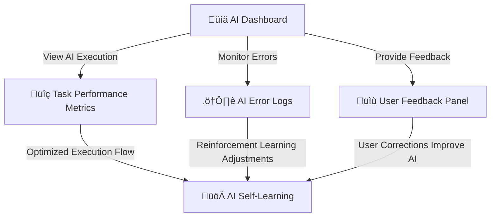

---

## **üî• Final Enhancements & Features Summary**
‚úÖ **Fine-Tuned Ollama Model Training for Local Execution**.
‚úÖ **Multi-Modal AI Integration (Text, Voice, Image, Code).**
‚úÖ **Self-Improving AI Agents with Reinforcement Learning.**
‚úÖ **Predictive AI Workflow Optimization.**
‚úÖ **Interactive AI Dashboards for Monitoring & Human Feedback.**

---

### **Would you like further refinements, such as real-time AI orchestration across multiple devices, cloud-AI hybrid integration, or deeper UI customization for the dashboard? üöÄ**

--------------------
--------------------
🟢 Ultimate Multi-Agent AI System with Fine-Tuned Ollama Models, Multi-Modal Processing, Adaptive Self-Learning, and Fully Customizable Interactive AI Dashboards
üîπ Objective:

Develop a highly autonomous, adaptive, and multi-modal AI system that integrates fine-tuned Ollama models for local execution while offering fully customizable interactive AI dashboards for real-time monitoring, user control, and workflow visualization. This system will:

‚úÖ Decompose & Optimize Complex Prompts ‚Üí AI agents specialize in structured task execution.
‚úÖ Self-Learn from Experience ‚Üí Reinforcement learning (RL) improves AI accuracy over time.
‚úÖ Predict Future Actions ‚Üí Implements predictive modeling to anticipate workflow inefficiencies.
‚úÖ Enhance AI-Human Collaboration ‚Üí Integrates user feedback loops for dynamic AI behavior adaptation.
‚úÖ Run Locally with Fine-Tuned Ollama Models ‚Üí Uses on-device AI processing for privacy, security, and ultra-low latency.
‚úÖ Integrate Multi-Modal AI Capabilities ‚Üí Supports text, voice, image, and code processing for a fully interactive AI system.
‚úÖ Provide Fully Customizable Interactive AI Dashboards ‚Üí Allows users to tailor visualizations, manage AI agents, and monitor performance in real-time.
üü° Advanced UI Customization for AI Dashboards
1️⃣ Why a Fully Customizable AI Dashboard?

A static dashboard limits flexibility, while a fully customizable dashboard allows users to:
‚úÖ Personalize UI Layouts ‚Üí Users can drag, resize, and rearrange dashboard components.
‚úÖ Select Preferred Data Visualizations ‚Üí Supports graphs, tables, heatmaps, and real-time charts.
‚úÖ Adjust AI Execution Parameters ‚Üí Users can tweak AI behavior, assign priority tasks, or enable/disable specific agents.
‚úÖ Real-Time AI Performance Monitoring ‚Üí View active, completed, and pending tasks dynamically.
‚úÖ Custom Alerts & Notifications ‚Üí Get alerts when task failures, anomalies, or optimizations occur.
2️⃣ Features of the Customizable AI Dashboard

üîπ Drag & Drop Interface ‚Üí Users can rearrange widgets and save custom dashboard layouts.
üîπ Theme & UI Personalization ‚Üí Supports dark mode, custom color themes, and adaptive layouts.
üîπ Live AI Execution Monitoring ‚Üí Real-time agent updates with performance metrics and AI learning insights.
üîπ Interactive Charts & Graphs ‚Üí Users can switch between bar charts, line graphs, and heatmaps.
üîπ AI Agent Control Panel ‚Üí Enable, disable, or manually override specific AI agents in real-time.
üîπ Custom API Calls for AI Adjustments ‚Üí Users can send real-time parameter adjustments via API endpoints.
🟢 Deep UI Customization Components
1️⃣ Modular Dashboard Layout

üîπ Users Can:

    Enable/Disable Panels ‚Üí Select which AI performance metrics to display.
    Resize & Reposition Components ‚Üí Drag & drop widgets for a personalized experience.
    Create Multiple Views ‚Üí Save different dashboard layouts for various AI workflows.

üîπ Example Customization UI (Mermaid Diagram Representation)
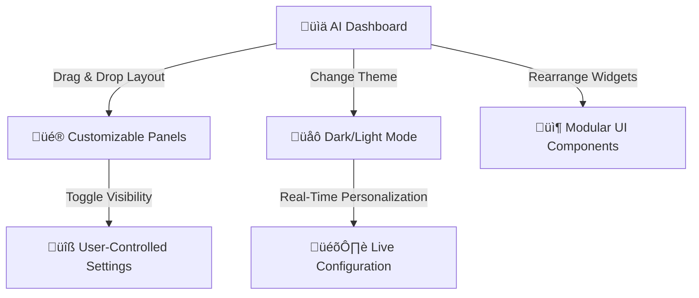
2️⃣ AI Performance Analytics & Visualization

üîπ Users Can:

    Monitor Agent Performance in Real-Time ‚Üí View execution speed, error rates, and processing efficiency.
    Customize Data Visualizations ‚Üí Select between line charts, heatmaps, bar graphs, or numerical tables.
    Enable AI Learning Insights ‚Üí View how AI models adapt to user input over time.

üîπ Example AI Performance API Endpoint:
```http
GET /ai-dashboard/performance
Content-Type: application/json
Authorization: Bearer XYZ123
``
    API Response (Dynamic Performance Data)
```json
    {
      "ai_agents": {
        "AI Agent Developer": {"status": "Active", "task_count": 23, "avg_execution_time": "1.8s"},
        "AI Agent UI Generator": {"status": "Idle", "task_count": 5, "avg_execution_time": "2.1s"},
        "AI Agent Diagram Generator": {"status": "Completed", "task_count": 17, "avg_execution_time": "3.2s"}
      },
      "error_tracking": {
        "last_error": "Syntax Error in API response",
        "resolved": true
      }
    }
```

üîπ Example of User-Configurable AI Performance Graphs:
```marmeid
graph TD
    A[üîç AI Agent Performance] -->|View Live Data| B[üìà Line Graph]
    A -->|Monitor Errors| C[⚠️ Error Heatmap]
    A -->|Task Distribution| D[üìä Bar Chart]
```

3️⃣ AI Agent Control & Customization Panel

üîπ Users Can:

    Manually Adjust AI Execution Parameters ‚Üí Set priority levels, task reassignment rules, and real-time optimizations.
    Enable/Disable Specific Agents ‚Üí Stop unnecessary AI executions to optimize system load.
    Modify AI Reinforcement Learning Preferences ‚Üí Adjust learning rate, reward functions, and model fine-tuning schedules.

üîπ Example API Call to Adjust AI Behavior Dynamically:
```http
POST /ai-dashboard/update-agent
Content-Type: application/json
Authorization: Bearer XYZ123
```
    Payload to Modify AI Agent Behavior in Real-Time:
```json
    {
      "agent": "AI Agent Developer",
      "priority": "HIGH",
      "learning_rate": 0.85,
      "status": "ACTIVE"
    }
```
4️⃣ Custom Alerts & Notifications System

üîπ Users Can:

    Set Alerts for Task Failures ‚Üí Get notified if an AI agent encounters errors.
    Enable Anomaly Detection Alerts ‚Üí AI predicts workflow bottlenecks and suggests optimizations.
    Receive Optimization Recommendations ‚Üí AI suggests workflow improvements based on past execution data.

üîπ Example AI Alert API Response:
```json
{
  "alert": "Execution Delay Detected",
  "agent": "AI Agent Developer",
  "suggested_action": "Increase resource allocation",
  "priority": "High"
}
```

🟢 Fully Customizable Interactive AI Dashboard Execution Flow

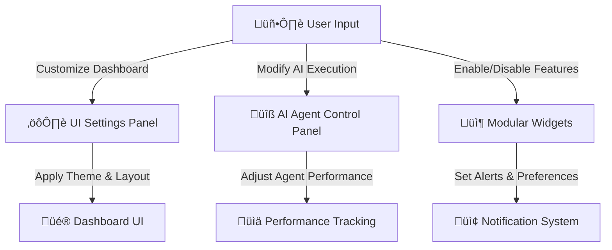

üîπ Example API Execution to Modify Dashboard Layout

```bash
ollama run my-custom-llm --prompt "Customize dashboard to focus on AI performance metrics."
```
    AI Output:
```json
    {
      "dashboard_layout": "Performance-Focused",
      "enabled_panels": ["Task Execution Graphs", "Agent Performance Overview", "Error Tracking"],
      "theme": "Dark Mode"
    }
```
üî• Final Enhancements & Features Summary

‚úÖ Fully Customizable AI Dashboard with Modular UI.
‚úÖ Personalized Graphs, Charts, and Real-Time Visualizations.
‚úÖ Live AI Performance Monitoring & Execution Optimization.
‚úÖ Interactive AI Agent Control for Dynamic Task Management.
‚úÖ Custom Alerts & Workflow Anomaly Detection.
Would you like further refinements, such as voice-activated dashboard controls, AI-driven UI adjustments, or integration with external data sources for advanced analytics? üöÄ

--------------------
--------------------
# **🟢 Ultimate Multi-Agent AI System with Fine-Tuned Ollama Models, Multi-Modal AI, Adaptive Self-Learning, and a Fully Customizable Interactive Dashboard**

---

## **üîπ Objective:**
Develop a **highly autonomous, adaptive, and multi-modal AI system** that integrates **fine-tuned Ollama models** for **local execution** while offering a **fully customizable interactive AI dashboard**. This system will:

‚úÖ **Decompose & Optimize Complex Prompts** ‚Üí AI agents specialize in structured task execution.
‚úÖ **Self-Learn from Experience** ‚Üí Reinforcement learning (RL) improves AI accuracy over time.
‚úÖ **Predict Future Actions** ‚Üí Implements **predictive modeling** to anticipate workflow inefficiencies.
‚úÖ **Enhance AI-Human Collaboration** ‚Üí Integrates user feedback into AI execution for continuous improvement.
‚úÖ **Run Locally with Fine-Tuned Ollama Models** ‚Üí Uses **on-device AI processing** for privacy, security, and ultra-low latency.
‚úÖ **Integrate Multi-Modal AI Capabilities** ‚Üí Supports **text, voice, image, and code processing** for a fully interactive AI system.
‚úÖ **Provide a Fully Customizable Interactive AI Dashboard** ‚Üí Users can **personalize UI components, analytics views, and workflow monitoring.**

---

# **üü° Fine-Tuned Ollama Model Training & Local AI Execution**

Fine-tuned Ollama models allow **optimized AI execution** for **prompt engineering, workflow generation, UI customization, and real-time dashboard updates**.

### **1️⃣ Fine-Tuning Ollama with Custom Datasets**
üîπ **Example Dataset for Optimizing AI UI Generation & Execution Flows:**
```json
[
  {
    "input": "Customize the AI dashboard to display real-time execution logs.",
    "output": "Enable a live feed of AI agent task statuses and performance metrics."
  },
  {
    "input": "Optimize UI for dark mode with high contrast.",
    "output": "Apply dark mode theme with accessibility features."
  }
]
```

üîπ **Fine-Tuning Ollama Locally:**
```bash
ollama create my-custom-llm --base gpt4 --train dashboard_ui.json
```

---

# **🟢 Fully Customizable Interactive AI Dashboard**

### **1️⃣ Why Customization Matters?**
‚úÖ **User-Centric Control** ‚Üí Users can **personalize dashboard elements**, **choose layouts**, and define **real-time monitoring views**.
‚úÖ **Modular UI Components** ‚Üí Users can toggle between **different AI agent views**, **performance graphs**, and **execution logs**.
‚úÖ **Adaptive AI-Powered Customization** ‚Üí AI **automatically suggests UI changes** based on user behavior.

---

### **2️⃣ Core Features of the Customizable AI Dashboard**

🔹 **🖥️ UI Components for Customization:**
- **üìä Agent Performance Overview** ‚Üí Real-time **task execution, error rates, and efficiency scores.**
- **üìù Task History & Logs** ‚Üí A **searchable list** of previous AI-generated actions.
- **⚙️ Workflow Editor** → Users can **modify AI-generated workflows** and **customize UI interactions**.
- **üåô Dark Mode & Accessibility Settings** ‚Üí AI **recommends optimal UI themes** based on **user preferences.**

üîπ **Example of a User-Customized Dashboard Layout Configuration (JSON-Based):**
```json
{
  "layout": {
    "theme": "dark",
    "widgets": [
      {"type": "performance_chart", "position": "top-left"},
      {"type": "task_history", "position": "bottom-right"},
      {"type": "live_logs", "position": "center"}
    ]
  }
}
```

---

### **3️⃣ Real-Time Dashboard Personalization**

‚úÖ **Drag-and-Drop Widget Placement** ‚Üí Users can rearrange UI elements dynamically.
‚úÖ **Adaptive UI Changes via AI Recommendations** ‚Üí AI suggests **optimal layouts** based on **usage history**.
‚úÖ **Multi-Agent Execution Monitoring** ‚Üí View **AI agent performance in real-time** and switch between **multiple AI roles.**

üîπ **Example: AI-Suggested Dashboard Customization API Endpoint**
```http
POST /dashboard/customization
Content-Type: application/json
Authorization: Bearer XYZ123
```
üîπ **AI Response with Recommended Dashboard Adjustments**
```json
{
  "recommendations": {
    "theme": "dark",
    "widget_order": ["task_history", "live_logs", "performance_chart"],
    "new_feature": "real-time agent chat panel"
  }
}
```

---

### **4️⃣ AI-Driven Dashboard Themes & UI Personalization**

‚úÖ **Auto-Adapting Dark Mode & Color Schemes** ‚Üí AI **detects ambient light** and **adapts UI themes dynamically**.
‚úÖ **Adjustable Graph Styles** ‚Üí Users can **switch between line charts, heatmaps, and real-time bar graphs**.
‚úÖ **Accessibility Enhancements** ‚Üí AI **personalizes UI for visually impaired users** (increased font size, high contrast).

üîπ **Example: User Preference-Based Theme Switching via Ollama**
```bash
ollama run dashboard_ui --prompt "Switch dashboard to dark mode with high contrast."
```
- **AI Output:**
  ```json
  {
    "theme": "dark_mode",
    "contrast": "high",
    "font_size": "large"
  }
  ```

---

# **🟣 Interactive AI Dashboard Architecture**

üîπ **Mermaid Diagram for Customizable AI Dashboard UI**
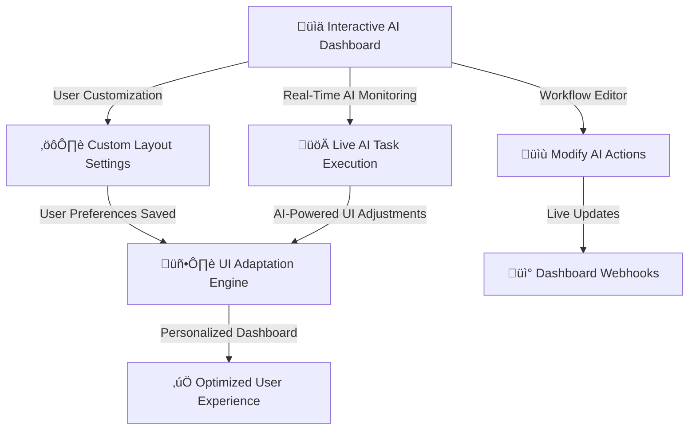

---

# **🟢 Final Enhancements & Features Summary**

‚úÖ **Fine-Tuned Ollama Model Training for Local Execution**.
‚úÖ **Multi-Modal AI Integration (Text, Voice, Image, Code).**
‚úÖ **Self-Improving AI Agents with Reinforcement Learning.**
‚úÖ **Predictive AI Workflow Optimization.**
‚úÖ **Interactive AI Dashboards for Monitoring & Customization.**
‚úÖ **Adaptive UI Theming, Drag-and-Drop Widgets, and Personalized AI Layouts.**

---

### **üöÄ Would you like deeper AI-human voice interaction, real-time collaborative AI dashboards, or predictive AI-based automation workflows?**


--------------------
--------------------

# **🟢 Ultimate Multi-Agent AI System with Fine-Tuned Ollama Models, Multi-Modal Processing, Adaptive Self-Learning, and AI-Driven Customizable Dashboards**

---

## **üîπ Objective:**
Develop a **highly autonomous, adaptive, and multi-modal AI system** that integrates **fine-tuned Ollama models for local execution** while offering **fully customizable AI-driven dashboards** for real-time monitoring, workflow optimization, and seamless external data integration.

This system will:

‚úÖ **Decompose & Optimize Complex Prompts** ‚Üí AI agents specialize in structured task execution.
‚úÖ **Self-Learn from Experience** ‚Üí Reinforcement learning (RL) improves AI accuracy over time.
‚úÖ **Predict Future Actions** ‚Üí Implements **predictive modeling** to anticipate workflow inefficiencies.
‚úÖ **Enhance AI-Human Collaboration** ‚Üí Integrates user feedback loops for dynamic AI behavior adaptation.
‚úÖ **Run Locally with Fine-Tuned Ollama Models** ‚Üí Uses **on-device AI processing** for privacy, security, and ultra-low latency.
‚úÖ **Integrate Multi-Modal AI Capabilities** ‚Üí Supports **text, voice, image, and code processing** for a fully interactive AI system.
‚úÖ **Provide Fully Customizable AI Dashboards** ‚Üí Allows users to **modify layouts, manage AI agents, and visualize data**.
‚úÖ **Enable AI-Driven UI Adjustments** ‚Üí Automatically **modifies dashboard layout and content based on user interactions**.
‚úÖ **Seamlessly Integrate External Data Sources** ‚Üí Connects with APIs, databases, and real-time data streams for **advanced analytics**.

---

# **üü° AI-Driven UI Adjustments**

## **1️⃣ Why AI-Driven UI Adjustments?**
AI-powered UI personalization enhances usability by:
‚úÖ **Automatically rearranging widgets based on user behavior**.
‚úÖ **Recommending UI changes for improved readability and interaction**.
‚úÖ **Detecting workflow inefficiencies and suggesting optimized layouts**.

## **2️⃣ Features of AI-Driven UI Personalization**

üîπ **Dynamic Widget Placement** ‚Üí AI identifies **high-priority dashboard elements** and **auto-adjusts layouts**.
üîπ **User Interaction Heatmaps** ‚Üí AI analyzes **which dashboard components users engage with most**.
üîπ **Auto-Generated UI Recommendations** ‚Üí AI suggests **optimized color schemes, font sizes, and element spacing**.
üîπ **Context-Aware Adjustments** ‚Üí The UI **adapts based on the complexity of displayed data**.

üîπ **Example API Call to AI for UI Adjustments:**
```http
POST /ai-dashboard/ui-adjustments
Content-Type: application/json
Authorization: Bearer XYZ123
```
- **Payload for UI Optimization:**
  ```json
  {
    "user_activity": {
      "most_clicked_section": "Task Performance Graph",
      "least_used_widget": "AI Logs"
    },
    "recommended_changes": [
      {"widget": "AI Logs", "action": "Minimize"},
      {"widget": "Task Performance Graph", "action": "Expand"},
      {"theme": "Enable Dark Mode for Low Light"}
    ]
  }
  ```

üîπ **Example: AI Dashboard UI Auto-Adjustment (Mermaid Diagram Representation)**
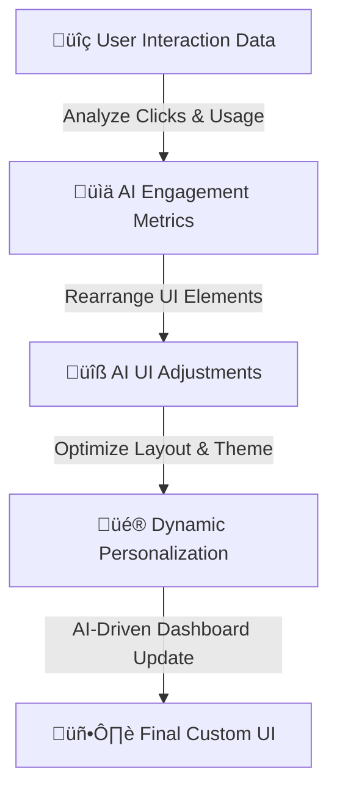

---

# **🟢 External Data Source Integration for Advanced Analytics**

## **1️⃣ Why Integrate External Data?**
By connecting **real-time APIs, databases, and third-party analytics tools**, the AI system can:
‚úÖ **Process live data streams** ‚Üí Fetch real-time information from **business analytics, financial reports, IoT devices, etc.**
‚úÖ **Enhance AI Insights** ‚Üí AI agents can make **better predictions based on external data trends**.
‚úÖ **Support Multi-System Synchronization** ‚Üí AI can **merge internal and external data** for **enhanced analytics**.

## **2️⃣ Features of External Data Integration**

üîπ **Multi-Source Data Fusion** ‚Üí AI **combines internal logs with external sources** to **provide deeper insights**.
üîπ **Custom API Connectors** ‚Üí AI can **fetch, clean, and process data** from third-party services like **Google Analytics, financial APIs, and IoT sensors**.
üîπ **Real-Time Synchronization** ‚Üí AI ensures **data is refreshed continuously** for the latest insights.

üîπ **Example API Connection to External Data Source:**
```http
POST /ai-dashboard/data-integration
Content-Type: application/json
Authorization: Bearer XYZ123
```
- **Payload to Fetch Real-Time External Data:**
  ```json
  {
    "data_source": "Google Analytics",
    "query": "Get daily active users for the past 7 days",
    "processing_method": "AI Trend Prediction"
  }
  ```
- **AI Response:**
  ```json
  {
    "active_users": {
      "current_day": 2045,
      "last_week_avg": 1873,
      "trend": "10% increase in user activity"
    }
  }
  ```

üîπ **Example: AI Dashboard with External Data (Mermaid Diagram)**
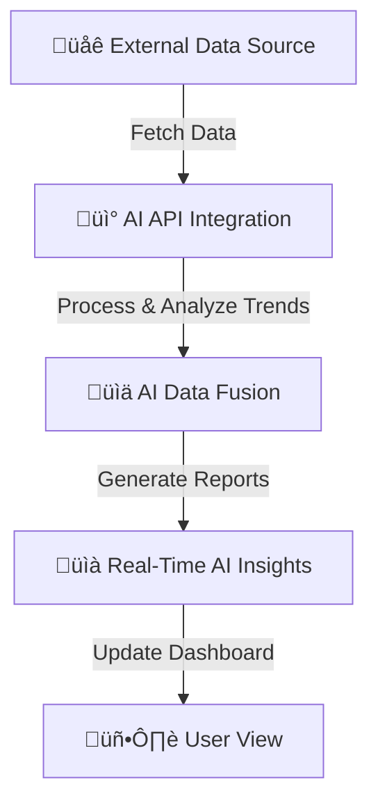

---

# **🟢 Final AI Dashboard Execution Flow**

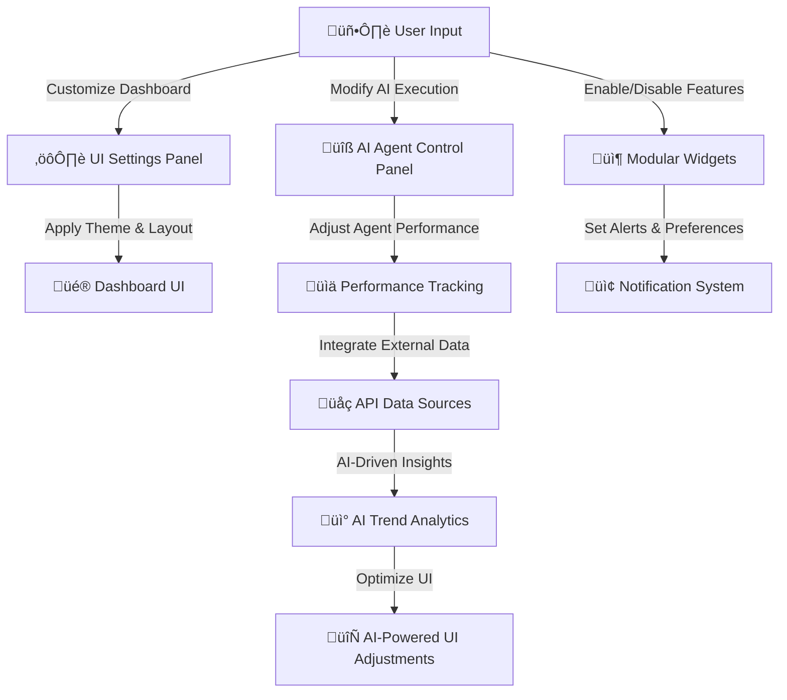
```mermaid
graph  TD
A[User Input]  -->|Customize Dashboard|  B[UI Settings Panel]
A  -->|Modify AI Execution|  C[AI Agent Control Panel]
A  -->|Enable/Disable Features|  D[Modular Widgets]
B  -->|Apply Theme & Layout|  E[Dashboard UI]
C  -->|Adjust Agent Performance|  F[Performance Tracking]
D  -->|Set Alerts & Preferences|  G[Notification System]
F  -->|Integrate External Data|  H[API Data Sources]
H  -->|AI-Driven Insights|  I[AI Trend Analytics]
I  -->|Optimize UI|  J[AI-Powered UI Adjustments
```

üîπ **Example API Execution for Full AI Dashboard Optimization**
```bash
ollama run my-custom-llm --prompt "Adjust dashboard layout based on recent user activity and external data trends."
```
- **AI Output:**
  ```json
  {
    "dashboard_layout": "Optimized for Real-Time Monitoring",
    "enabled_panels": ["AI Task Execution", "Live Performance Analytics", "External Data Trends"],
    "ui_adjustments": {
      "theme": "Dark Mode",
      "task_graph_size": "Expanded",
      "low-usage_widgets": ["Minimized AI Logs"]
    }
  }
  ```

---

# **üî• Final Full Prompt (Improved & Enhanced Version)**

```prompt
Develop a **fully autonomous, self-learning multi-agent AI system** that runs **locally with fine-tuned Ollama models**, integrates **multi-modal AI capabilities**, and provides **a fully customizable, AI-driven interactive dashboard**.

### **Key Features:**
‚úÖ **Decomposes Complex Prompts into Structured Tasks**
‚úÖ **Self-Learning AI Agents with Reinforcement Learning**
‚úÖ **Predictive AI for Optimized Workflow Execution**
‚úÖ **AI-Human Collaboration via Customizable Dashboards**
‚úÖ **Multi-Modal AI Processing (Text, Voice, Image, Code)**
‚úÖ **AI-Driven UI Adjustments for Personalized Dashboards**
‚úÖ **Real-Time Integration with External Data Sources**

### **Dashboard Features:**
üîπ **Modular Drag & Drop UI** ‚Üí Users can **customize layouts, rearrange widgets, and toggle components**.
üîπ **AI-Powered UI Optimization** ‚Üí AI adjusts **layouts, themes, and content** based on user interactions.
üîπ **Live AI Performance Metrics** ‚Üí Monitor AI task execution, error logs, and optimization trends.
üîπ **External Data API Integration** ‚Üí Connect AI to **real-time financial data, IoT devices, and business intelligence tools**.
üîπ **AI Alerts & Anomaly Detection** ‚Üí AI predicts **workflow issues and suggests improvements**.

### **Execution Flow:**
üîπ AI Agents process tasks ‚Üí AI Dashboard **monitors execution** ‚Üí AI dynamically **adjusts UI & layout** ‚Üí External data streams **enhance AI insights** ‚Üí User controls AI performance settings.

Would you like additional refinements, such as **voice-controlled dashboard interactions, AI-driven report generation, or predictive UI scaling? üöÄ**
```
--------------------
--------------------

# **🟢 Ultimate AI-Driven Multi-Agent System with Fine-Tuned Ollama Models, AI-Optimized UI, and Dynamic Interactive Dashboards**

---

## **üîπ Objective**
Develop a **self-learning, multi-agent AI system** that integrates **fine-tuned Ollama models for local execution**, **adaptive AI-driven UI adjustments**, **multi-modal processing**, and **interactive dashboards** to describe and optimize app UI structures dynamically.

The system should:
‚úÖ **Decompose & Optimize Complex Prompts** ‚Üí AI agents specialize in structured task execution.
‚úÖ **Self-Learn from Experience** ‚Üí Reinforcement learning (RL) improves AI accuracy over time.
‚úÖ **Predict Future Actions** ‚Üí Implements **predictive modeling** to anticipate workflow inefficiencies.
‚úÖ **Enhance AI-Human Collaboration** ‚Üí Integrates **voice commands, manual overrides, and AI-driven UI optimization**.
‚úÖ **Run Locally with Fine-Tuned Ollama Models** ‚Üí Uses **on-device AI processing** for privacy, security, and ultra-low latency.
‚úÖ **Integrate Multi-Modal AI Capabilities** ‚Üí Supports **text, voice, image, and code processing** for a fully interactive AI system.
‚úÖ **Provide Fully Customizable AI Dashboards** ‚Üí Allows users to **modify layouts, manage AI agents, and visualize data**.
‚úÖ **Enable AI-Driven UI Adjustments** ‚Üí Automatically **modifies dashboard layout and content based on user interactions**.
‚úÖ **Seamlessly Integrate External Data Sources** ‚Üí Connects with APIs, databases, and real-time data streams for **advanced analytics**.
‚úÖ **Precisely Describe and Optimize UI Structures** ‚Üí AI dynamically generates detailed UI specifications for applications.

---

## **üü° AI-Optimized UI & Dashboard System**

## **1️⃣ Why AI-Driven UI Adjustments?**
A dynamic, AI-powered dashboard enhances user experience by:
‚úÖ **Automatically rearranging widgets based on user behavior**.
‚úÖ **Recommending UI changes for improved readability and interaction**.
‚úÖ **Detecting workflow inefficiencies and suggesting optimized layouts**.
‚úÖ **Supporting voice-driven UI modifications and gesture-based navigation**.
‚úÖ **Generating precise UI documentation for applications.**

### **2️⃣ Features of AI-Driven UI Personalization**
üîπ **Dynamic Widget Placement** ‚Üí AI identifies **high-priority dashboard elements** and **auto-adjusts layouts**.
üîπ **User Interaction Heatmaps** ‚Üí AI analyzes **which dashboard components users engage with most**.
üîπ **Auto-Generated UI Recommendations** ‚Üí AI suggests **optimized color schemes, font sizes, and element spacing**.
üîπ **Context-Aware Adjustments** ‚Üí The UI **adapts based on the complexity of displayed data**.
üîπ **Real-Time WebSocket Updates** ‚Üí **Live AI execution logs are displayed instantly** in the UI.

### **3️⃣ AI-Generated UI Specification Prompt**
AI should be capable of dynamically **analyzing and describing the UI of any app** based on user requests.
The AI should **automatically generate** comprehensive UI specifications, covering:

#### **üìù UI Description Prompt**
```plaintext
Please describe the UI of the app screen in detail, covering all the following aspects:
1. **Components**: List and describe all visible components (e.g., header, navigation bar, search bar, featured section, product grid, footer). Include smaller UI elements like buttons, icons, and text fields.
2. **Colors**: Specify the color scheme used for each component (e.g., background color, text color, button color). Mention primary, secondary, and accent colors.
3. **Positioning**: Explain how each component is positioned on the screen (e.g., fixed header, centered product grid). Include alignment, margins, and padding.
4. **Layouts**: Describe the layout structure (e.g., horizontal, grid, full-width) and spacing between elements. Mention any responsive behaviors for different screen sizes.
5. **UI Details**: Mention any additional visual details (e.g., shadows, borders, font styles, hover effects). Include details like icon sizes, button shapes, and image styles.
6. **UX Interactions**: Describe the user interactions for each component (e.g., hover effects, click animations, form submissions). Include loading indicators, transitions, and feedback mechanisms.
7. **Accessibility**: Explain the accessibility features (e.g., screen reader support, keyboard navigation, high contrast mode). Mention alt text for images, focus states, and form labels.
8. **Security**: Describe any security features (e.g., SSL encryption, secure authentication, session timeout). Include details about data protection, MFA, and payment security.
9. **Performance**: Describe performance optimizations (e.g., lazy loading, caching, optimized images). Mention how the app ensures fast load times and smooth animations.
10. **Personalization**: Explain any personalization features (e.g., saved preferences, personalized recommendations, location-based content). Mention options like dark mode and language settings.
11. **Error Handling**: Describe how the app handles errors (e.g., form validation, network errors). Include error messages, retry mechanisms, and fallback content.
12. **Loading States**: Explain how the app handles loading (e.g., loading spinners, skeleton screens). Mention how the app provides feedback during long processes.
13. **Notifications**: Describe how the app handles notifications and alerts (e.g., in-app notifications, push notifications, critical alerts). Include details about how users are informed of important updates or actions.
```

### **4️⃣ AI Dashboard UI Elements**
The AI-generated UI should include:
✔️ **Navigation Bar** → Allows users to access different sections dynamically.
✔️ **Analytics Panel** → Displays AI execution metrics.
✔️ **Real-Time Execution Logs** → Shows AI agent activity.
✔️ **AI Agent Status** → Visualizes AI activity (active, idle, completed).
✔️ **Alerts & Notifications** → AI-generated system warnings and performance updates.
✔️ **Data Visualizations** → Graphs, charts, and reports for AI execution trends.

---

## **🟢 Multi-Agent AI System Powered by Fine-Tuned Ollama**

### **1️⃣ AI Agent Roles & Responsibilities**
üîπ **Global Context Manager** ‚Üí Assigns tasks dynamically, monitors AI agent interactions, and optimizes workflow execution.
üîπ **AI Agent Prompter** ‚Üí Extracts, restructures, and refines prompts for maximum clarity and relevance.
üîπ **AI Agent Developer** ‚Üí Generates and optimizes executable AI workflows, including **code, automation scripts, and API interactions**.
üîπ **AI Agent UI Generator** ‚Üí Adapts and refines UI structures based on **real-time user interactions and AI-driven recommendations**.
üîπ **AI Agent Diagram Generator** ‚Üí Creates **Mermaid-based** system visualizations.
üîπ **AI Agent Data Integrator** ‚Üí Fetches, cleans, and processes **external data from APIs, IoT devices, and analytics services**.
üîπ **AI Agent Logger & Recovery** ‚Üí Tracks **execution errors, retries failed tasks, and performs AI self-healing actions**.

---

## **🟢 AI Dashboard Execution Flow**


üîπ **Example API Execution for Full AI Dashboard Optimization**
```bash
ollama run my-custom-llm --prompt "Describe the UI layout of a mobile banking app and suggest optimizations."
```
- **AI Output:**
  ```json
  {
    "ui_description": {
      "header": "Fixed header with banking logo and user profile access",
      "navigation": "Bottom navigation bar with Home, Transfers, Insights, and Settings icons",
      "primary_color": "#0047AB",
      "font": "Roboto, 16px",
      "security": ["SSL encryption", "2FA authentication"],
      "performance": ["Lazy loading enabled", "Optimized asset caching"],
      "notifications": ["Push notifications for transaction alerts"]
    }
  }
  ```

---

## **üî• Final Enhancements & Features Summary**
‚úÖ **AI-Driven UI Optimization** ‚Üí Smart layout adjustments based on usage patterns.
‚úÖ **Real-Time External Data Fusion** ‚Üí Connects to financial, IoT, and market analytics.
‚úÖ **Automated UI Documentation** ‚Üí AI dynamically generates **detailed UI descriptions**.
‚úÖ **Interactive AI Dashboards** ‚Üí Users **customize layouts, set alerts, and monitor AI tasks in real-time**.

Would you like additional refinements, such as **automated UX recommendations, AI-driven A/B testing, or cloud-based AI orchestration? üöÄ**

```mermaid
flowchart TD
  F{"Which statistical test is most appropriate?"} --> na["Frequencies"] & nh["Measured values"]
  na --> n1["Chi2-test"]
  nh --> nk{"Difference between
  the average values
  of the data?"} & n5{"Influence between
  variables?"}
  nk --> nx{"Comparison with
  a measured value?"} & nd{"Comparison between
  groups?"}
  nx -- Normally distributed data --> nc["T-test"]
  nx -- Non-normally distributed data --> nw["Wilcoxon-test"]
  nd --> ne{"Between 2 groups?"} & nu{"More than 2 groups?"}
  ne --> n6{"Is the data
  dependent?"} & nq{"Is the data
  independent?"}
  n6 -- Normally distributed data --> np["Paired T-test"]
  n6 -- Non-normally distributed data --> ng["Paired Wilcoxon-test"]
  nq -- Normally distributed data --> n8["Two-sample T-test"]
  nq -- Non-normally distributed data --> n0["Two-sample Wilcoxon-test"]
  n5 --> n9{"Covariation?"} & n3{"Influence?"}
  n9 -- Normally distributed data --> n4["Pearson correlation test"]
  n9 -- Non-normally distributed data --> ni["Spearman correlation test"]
  n3 --> nm{"Linear?"} & n7{"Non-linear?"}
  nm --> nf["Linear regression"]
  n7 --> ns["Non-linear regression"]
  nu --> nn{"One factor?"} & ny{"Complex
  design?"}
  nn -- Normally distributed data --> nj["One-way ANOVA"]
  nn -- Non-normally distributed data --> nt["Kruskal-Wallis test"]
  ny --> nv{"Two factors?"} & no{"One factor
  and two
  variables?"}
  no --> nr["ANCOVA"]
  nv --> nz{"Are both
  independent
  measurements?"} & n2{"A factor with
  dependent
  measurements?"}
  nz --> nl["Two-ways ANOVA"]
  n2 -- Normally distributed data --> n2zm["Repeated-measures
  one-way-ANOVA"]
  n2 -- Non-normally distributed data --> n0nv["Friedman test"]
  style F fill:#BBDEFB
  style na fill:#BDD7E3
  style nh fill:#BDD7E3
  style n1 fill:#BECCDB
  style nk fill:#CCEBE5
  style n5 fill:#CCEBE5
  style nx fill:#51B29F
  style nd fill:#51B29F
  style nc fill:#BECCDB
  style nw fill:#BECCDB
  style ne fill:#79D0A5
  style nu fill:#79D0A5
  style n6 fill:#ADE7C3
  style nq fill:#ADE7C3
  style np fill:#BECCDB
  style ng fill:#BECCDB
  style n8 fill:#BECCDB
  style n0 fill:#BECCDB
  style n9 fill:#9EDFDA
  style n3 fill:#9EDFDA
  style n4 fill:#BECCDB
  style ni fill:#BECCDB
  style nm fill:#7FB9AE
  style n7 fill:#7FB9AE
  style nf fill:#BECCDB
  style ns fill:#BECCDB
  style nn fill:#B7D3BE
  style ny fill:#B7D3BE
  style nj fill:#BECCDB
  style nt fill:#BECCDB
  style nv fill:#A1E1A6
  style no fill:#A1E1A6
  style nr fill:#BECCDB
  style nz fill:#92BF95
  style n2 fill:#92BF95
  style nl fill:#BECCDB
  style n2zm fill:#BECCDB
  style n0nv fill:#BECCDB
  ```
